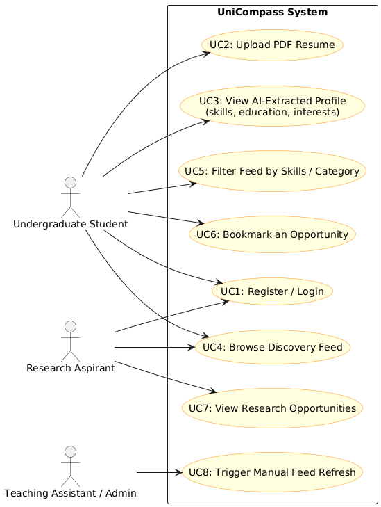
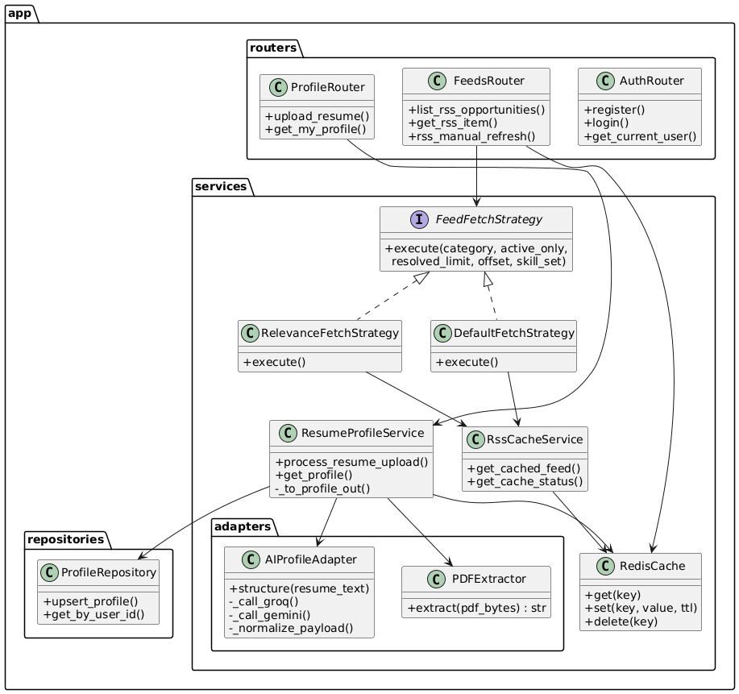
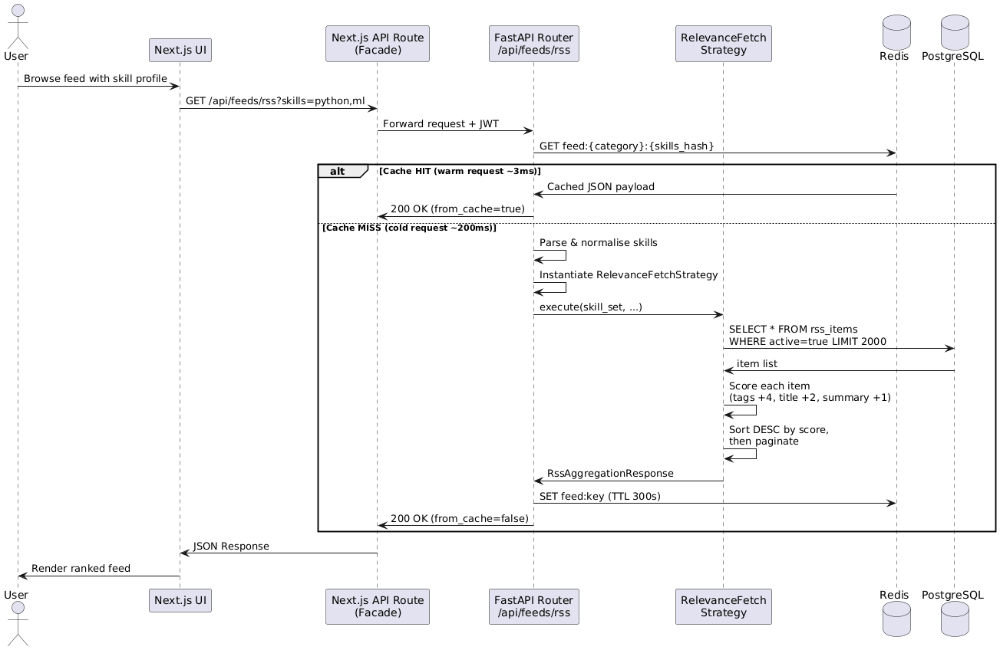
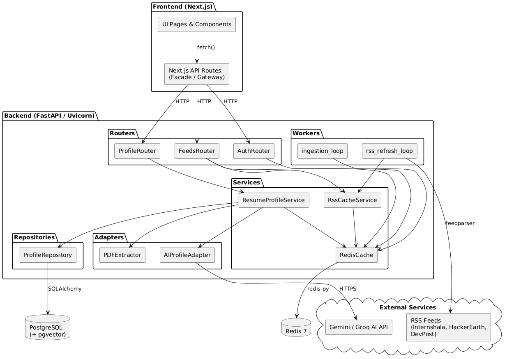
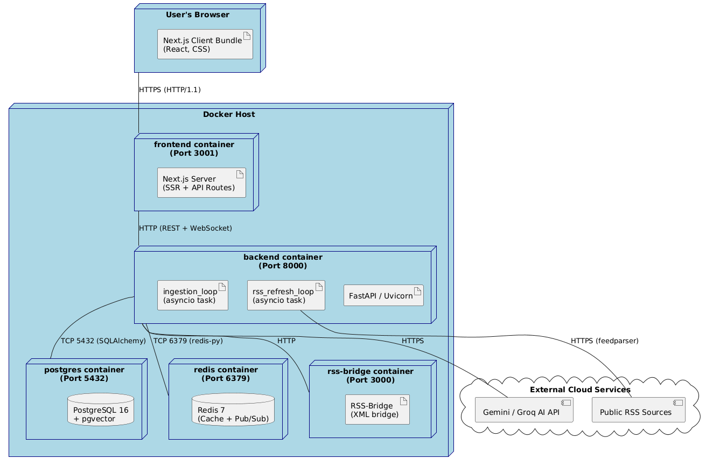

# UniCompass: AI-Powered Opportunity Discovery Platform
## Comprehensive Architectural Report

---

## Table of Contents
1. [Task 1: Requirements and Subsystems](#task-1-requirements-and-subsystems)
   - [1. Functional Requirements (FR)](#1-functional-requirements-fr)
   - [2. Non-Functional Requirements (NFR)](#2-non-functional-requirements-nfr)
   - [3. Architecturally Significant Requirements](#3-architecturally-significant-requirements)
   - [4. Subsystem Overview](#4-subsystem-overview)
2. [Task 2: Architecture Framework](#task-2-architecture-framework)
   - [Part 1: Stakeholder Identification (IEEE 42010)](#part-1-stakeholder-identification-ieee-42010)
   - [Part 2: Architecture Decision Records (ADRs)](#part-2-architecture-decision-records-adrs)
   - [Summary](#summary)
3. [Task 3: Architectural Tactics and Patterns](#task-3-architectural-tactics-and-patterns)
   - [Part 1: Architectural Tactics](#part-1-architectural-tactics)
   - [Part 2: Implementation Patterns](#part-2-implementation-patterns)
   - [Summary Table](#summary-table)
4. [Task 4: Architecture Comparison](#task-4-architecture-comparison--implemented-vs-alternative-pattern)
****
---

# Task 1: Requirements and Subsystems

## 1. Functional Requirements (FR)
Functional requirements define the core capabilities and services the UniCompass system provides to its users.

- **FR-1: Multi-Source Opportunity Aggregation**
  The system shall fetch opportunities (internships, hackathons, research openings, courses) from various sources including RSS feeds (e.g., Internshala, HackerEarth) and external Job APIs (Adzuna, Jooble, Semantic Scholar).
  
- **FR-2: AI-Powered Profile Extraction**
  The system shall allow users to upload PDF resumes and automatically extract structured data such as skills, education, and experience using the Gemini API to populate user profiles.

- **FR-3: Unified Discovery Feed**
  The system shall present a consolidated feed of opportunities that can be filtered by category and sorted by "Latest" or "Most Relevant".

- **FR-4: Semantic Matching & Personalized Ranking**
  The system shall use vector embeddings (Sentence-Transformers) and similarity search (pgvector) to rank opportunities according to the user's extracted skills and interests.

- **FR-5: Real-Time Notifications**
  The system shall notify users in real-time via WebSockets when new opportunities that strongly match their profile are ingested into the database.

- **FR-6: Opportunity Bookmarking**
  Users shall be able to save/bookmark specific opportunities for future reference and easy access.

- **FR-7: Authentication & User Management**
  The system shall provide secure user registration and login functionality using JWT-based authentication.

## 2. Non-Functional Requirements (NFR)
Non-functional requirements specify the quality attributes, performance targets, and constraints of the system.

- **NFR-1: Performance (Low Latency)**
  The discovery feed should load in under 200ms for cached requests. This is achieved through a multi-layer Redis caching strategy for feeds and individual opportunities.

- **NFR-2: Scalability**
  The background ingestion engine must be able to handle hundreds of concurrent RSS feeds and API sources without impacting the responsiveness or stability of the main web API.

- **NFR-3: Accuracy (Relevance)**
  The semantic matching engine should provide high-relevance rankings, ensuring users see the most appropriate opportunities based on their professional background.

- **NFR-4: Availability**
  The system should ensure that background workers are resilient to network failures and that real-time notification services remain connected during active user sessions.

- **NFR-5: Data Deduplication**
  The system must ensure that duplicate opportunities from different sources are identified (via source URLs) and merged into a single entry to prevent clutter in the feed.

## 3. Architecturally Significant Requirements
These are the key requirements that have a major impact on the system’s design and architectural choices:

- **Background Data Ingestion**: The requirement to aggregate high-volume data from fragmented external sources necessitated a decoupled ingestion architecture. Background workers avoid blocking the main API thread during long-running network operations.
- **Semantic Personalization**: The need for "Relevance-based" sorting required the integration of a vector database extension (`pgvector`) and an embedding pipeline, which is a significant architectural shift from traditional keyword-based filtering.
- **Real-Time Event Driven Updates**: The real-time notification requirement led to the implementation of the **Observer/Pub-Sub** pattern (via Redis) and WebSockets, allowing the backend to push data to the frontend proactively.
- **Unified Data Normalization**: The variety of source formats (RSS, JSON APIs) dictated the use of the **Facade & Adapter** design patterns to normalize data into a standard `OpportunityCard` format at the architectural level.

## 4. Subsystem Overview

The UniCompass system is divided into several logical subsystems, each with a specific role:

| Subsystem             | Description                                                                                                                         | Key Technologies                |
| :-------------------- | :---------------------------------------------------------------------------------------------------------------------------------- | :------------------------------ |
| **Frontend UI**       | Manages user interaction, displays the discovery feed, provides profile management interfaces, and renders real-time notifications. | React, Next.js, TailwindCSS     |
| **Backend API**       | Orchestrates business logic, manages user authentication, provides RESTful endpoints, and handles application state.                | Python, FastAPI, JWT            |
| **Ingestion Engine**  | A dedicated background process that polls RSS feeds and external APIs, parses content, and normalizes it for storage.               | Feedparser, External APIs       |
| **Matching Engine**   | Generates embeddings for opportunities and profiles; performs vector similarity searches to enable personalized rankings.           | Sentence-Transformers, pgvector |
| **Persistence Layer** | Handles structured data storage (users/opportunities) and high-speed caching/message brokering for inter-service communication.     | PostgreSQL, Redis               |
| **AI/ML Service**     | Provides intelligent processing for unstructured data, specifically extracting structured profile information from PDF resumes.     | Gemini API, PyMuPDF             |


# Task 2: Architecture Framework

**Project:** UniCompass — AI-Powered Opportunity Discovery Platform for Students  
**Standard Applied:** IEEE 42010:2011 (Systems and Software Engineering — Architecture Description)  
**ADR Template:** Nygard ADR Format  

---

## Part 1: Stakeholder Identification (IEEE 42010)

> IEEE 42010:2011 defines an architecture description as a work product that documents an architecture in terms of **stakeholders**, their **concerns**, the **viewpoints** that frame those concerns, and the **views** that conform to those viewpoints.

---

### 1.1 Identified Stakeholders

Based on the UniCompass project requirements document, the following stakeholders have been identified:

| ID  | Stakeholder                                           | Role / Description                                                                                                                                                      |
| --- | ----------------------------------------------------- | ----------------------------------------------------------------------------------------------------------------------------------------------------------------------- |
| SH1 | **Undergraduate Students**                            | Primary end-users who browse the discovery feed, filter opportunities, bookmark items, and upload resumes for AI-based profile extraction.                              |
| SH2 | **Postgraduate / Research Aspirants**                 | End-users who leverage the Semantic Scholar integration to discover research openings, published papers, and lab opportunities.                                         |
| SH3 | **System Architects / Developers (Team 18)**          | Design and build the system. Responsible for ensuring that architectural decisions align with quality attributes like scalability, maintainability, and performance.    |
| SH4 | **Academic Evaluators / Teaching Assistants**         | Assess project deliverables for compliance with software engineering standards, design pattern usage, and architectural quality.                                        |
| SH5 | **External API Providers**                            | Third-party services (Adzuna, Jooble, Semantic Scholar, Internshala RSS, HackerEarth RSS, DevPost RSS) whose APIs and feeds provide raw opportunity data to the system. |
| SH6 | **Database Administrator (Logical Role)**             | Responsible for PostgreSQL schema design, pgvector extension management, and Redis configuration. May overlap with SH3 in a small team.                                 |
| SH7 | **AI/ML Service Provider (Google DeepMind / Gemini)** | The Gemini API is used for resume parsing and structured data extraction; its availability, token limits, and API changes directly affect the system.                   |

---

### 1.2 Stakeholder Concerns

Each stakeholder has distinct concerns about the system that must be addressed by the architecture:

| Stakeholder                               | Key Concerns                                                                                                                                                                                                                                                 |
| ----------------------------------------- | ------------------------------------------------------------------------------------------------------------------------------------------------------------------------------------------------------------------------------------------------------------ |
| **SH1 – Undergraduate Students**          | Discovery feed loads quickly (< 200 ms for cached responses); opportunities are accurate, relevant, and up-to-date; resume parsing correctly identifies their skills; bookmarks are reliably persisted; the interface is intuitive and works on all devices. |
| **SH2 – Research Aspirants**              | Research opportunities from Semantic Scholar are surfaced alongside jobs and internships; semantic ranking prioritizes relevance to academic interests; profile embeddings reflect postgraduate intentions.                                                  |
| **SH3 – Architects / Developers**         | Clean separation of concerns across subsystems (Ingestion, Matching, API, Frontend); system is extensible to support new opportunity sources; background workers do not block the main API thread; codebase is maintainable and follows SOLID principles.    |
| **SH4 – Academic Evaluators**             | IEEE 42010–compliant architecture documentation; demonstrable use of recognized design patterns (Facade, Adapter, Strategy, Observer/Pub-Sub); adherence to the project requirements specification; clear ADRs justifying major decisions.                   |
| **SH5 – External API Providers**          | Rate limits are respected; API keys are securely stored; failures in one provider do not cascade to others; source attribution is maintained in opportunity records.                                                                                         |
| **SH6 – Database Administrator**          | Schema is normalized with appropriate indexing; pgvector extension is correctly installed; Redis TTLs and invalidation strategies prevent stale data; data deduplication prevents record proliferation.                                                      |
| **SH7 – AI/ML Service Provider (Gemini)** | API calls are well-formed and within quota; prompts are deterministic and produce structured JSON output; fallback behavior exists for API outages or malformed responses.                                                                                   |

---

### 1.3 Architecture Viewpoints (Kruchten's 4+1 View Model)

Following the **4+1 View Model** (Kruchten, 1995), five complementary viewpoints are defined to address the concerns of all stakeholders. The **Scenarios view** acts as the glue that ties the other four views together.

| View                          | Perspective               | Addressed Concerns                                                                      | Primary Stakeholders |
| ----------------------------- | ------------------------- | --------------------------------------------------------------------------------------- | -------------------- |
| **Scenarios (Use Case View)** | Putting it all together   | System consistency, end-to-end flows, and key use cases that validate the architecture. | All Stakeholders     |
| **Logical View**              | End-user functionality    | Functional requirements; key classes, interfaces, and their relationships.              | SH1, SH2, SH3, SH4   |
| **Process View**              | Integrators / Performance | Runtime concurrency, performance, scalability, and availability concerns.               | SH3, SH5, SH6        |
| **Development View**          | Developers / Programmers  | Static software organization — packages, modules, layers, and build structure.          | SH3, SH4             |
| **Physical View**             | System engineers          | Hardware topology, deployment environment, and physical communication links.            | SH3, SH6             |

---

### 1.4 Architecture Views

Each view corresponds to one viewpoint from the 4+1 model and provides a concrete, multi-dimensional description of the UniCompass architecture.

---

#### 1.4.1 Scenarios — Use Case View

> **Perspective:** All stakeholders. Scenarios illustrate how the architecture serves real user needs and are used to validate the other four views.

**Use Case Diagram:**



**Key Highlights:**
- **Stakeholder Mapping:** Identifies three primary actors: Undergraduate Students, Research Aspirants, and System Admins.
- **Critical Paths:** Captures the "Resume-to-Discovery" journey as the central value proposition.
- **Validation:** Used to ensure the architecture supports manual ingestion triggers for admins and personalized filtering for students.

---

#### 1.4.2 Logical View

> **Perspective:** End-user functionality. Describes the key classes, interfaces, and their relationships that implement the system's functional requirements.

**Class Diagram :**


**Key Highlights:**
- **Design Patterns:** Explicitly implements the **Strategy Pattern** for feed ranking and the **Facade pattern** for API aggregation.
- **Service Decoupling:** Separates AI extraction logic (PyMuPDF + Gemini) from the core feed delivery service.
- **Data Integrity:** Defines the repository layer to ensure all opportunity metadata follows the `NormalizedRssItem` schema.
---

#### 1.4.3 Process View

> **Perspective:** Integrators / Performance. Focuses on runtime concurrency, system interactions, and the performance-critical personalized feed fetch flow.

**Sequence Diagram — Personalized Feed Fetch:**



**Key Highlights:**
- **Concurrency:** Demonstrates how background ingestion workers operate independently of the user's HTTP request lifecycle.
- **Latency Optimization:** Visualizes the **Cache-Aside** logic where Redis reduces P99 latency by intercepting repeat queries.
- **Resilience:** Shows how the system gracefully handles timeouts when external RSS sources are slow or unreachable.
---

#### 1.4.4 Development View

> **Perspective:** Developers / Programmers. Describes the static organization of software into packages, layers, and deployable modules.

**Component Diagram:**



**Key Highlights:**
- **Modular Monolith:** Shows the organization of the FastAPI backend into distinct `Routers`, `Services`, and `Adapters`.
- **Package Management:** Illustrates the boundaries between the Next.js frontend and the Python-based ingestion core.
- **Shared Schemas:** Highlights the use of Pydantic models as the "contract" between the Ingestion Engine and the API.
---

#### 1.4.5 Physical View

> **Perspective:** System engineers. Describes the mapping of software components onto hardware/container nodes and the communication protocols between them.

**Deployment Diagram:**



**Key Highlights:**
- **Containerization:** Defines the multi-container **Docker Compose** environment (Frontend, Backend, Postgres, Redis, RSS-Bridge).
- **Network Isolation:** Maps specific port bindings (e.g., 8000 for API, 5432 for DB) to ensure secure communication.
- **Environmental Security:** Describes how `.env.local` secrets are injected into the backend container at runtime.
---


**Subsystem Responsibilities:**

| Subsystem             | Responsibility                                                                                                                                                                                                                                                       |
| --------------------- | -------------------------------------------------------------------------------------------------------------------------------------------------------------------------------------------------------------------------------------------------------------------- |
| **Frontend UI**       | Renders the discovery feed, manages authentication UI (login/register), provides resume upload UX, displays real-time notification bell via WebSocket.                                                                                                               |
| **Backend API**       | Orchestrates all business logic; exposes `/auth`, `/api/feed`, and `/profile` RESTful endpoints; manages JWT middleware; acts as WebSocket server for notifications.                                                                                                 |
| **Ingestion Engine**  | Polls external sources (RSS feeds via Feedparser, Adzuna API, Jooble API) on a periodic schedule; uses the Facade + Adapter pattern to normalize disparate data formats into a common `NormalizedRssItem` schema; deduplicates by source URL; upserts to PostgreSQL. |
| **Matching Engine**   | Encodes opportunity text and user profiles as vector embeddings (Sentence-Transformers); stores embeddings in PostgreSQL via pgvector; performs cosine similarity search for relevance-based feed sorting.                                                           |
| **AI/ML Service**     | Receives uploaded PDF resumes; extracts raw text via PyMuPDF; sends text to Gemini API with a structured prompt; parses returned JSON for skills, education, and experience.                                                                                         |
| **Persistence Layer** | PostgreSQL serves as the primary relational data store (users, opportunities, bookmarks, profiles, embeddings). Redis serves as a high-speed cache for feed responses, profile data, and a Pub/Sub broker for real-time notification events.                         |

---

#### View 2 — Information / Data View (VP-2)

This view describes the primary data entities and how data flows through the system:

**Core Data Entities:**

| Entity                    | Primary Store | Key Attributes                                                                                      |
| ------------------------- | ------------- | --------------------------------------------------------------------------------------------------- |
| `User`                    | PostgreSQL    | id, name, email, hashed_password, skills[], interests[], profile_embedding (vector)                 |
| `Opportunity (rss_items)` | PostgreSQL    | id, title, url (unique key for dedup), source, category, published_at, deadline, embedding (vector) |
| `Bookmark`                | PostgreSQL    | user_id (FK), opportunity_id (FK), created_at                                                       |
| `UserProfile`             | PostgreSQL    | user_id (FK), extracted_skills, education, experience (jsonb)                                       |
| `Feed Cache`              | Redis         | Key: `feed:{category}:{sort}:{page}`, TTL: 5–10 min                                                 |
| `Profile Cache`           | Redis         | Key: `profile:{user_id}`, TTL: 1 hour                                                               |
| `Opportunity Cache`       | Redis         | Key: `opportunity:{id}`, TTL: 30 min                                                                |
| `Notification Event`      | Redis Pub/Sub | Channel: `notifications:{user_id}`, payload: opportunity match                                      |

**Data Flow — Ingestion Pipeline:**
```
External Sources (RSS/Adzuna/Jooble)
        │
        ▼
[Adapter Layer] — Parse & normalize to NormalizedRssItem
        │
        ▼
[AggregatorFacade] — Merge + deduplicate by source URL
        │
        ▼
[Background Worker] — Upsert to PostgreSQL rss_items table
        │
        ▼
[Matching Engine] — Compute embeddings, store via pgvector
        │
        ▼
[Redis Cache Invalidation] — Clear stale feed:{*} keys
```

**Data Flow — Resume Upload:**
```
User uploads PDF (Frontend)
        │
        ▼
POST /profile/upload-resume (Backend API)
        │
        ▼
PyMuPDF — Extract raw text
        │
        ▼
Gemini API — Structured JSON (skills, education, experience)
        │
        ▼
PostgreSQL — Persist UserProfile
        │
        ▼
Redis — Invalidate profile:{user_id}
```

---

#### View 3 — Deployment / Infrastructure View (VP-3)

This view describes how UniCompass components are deployed across infrastructure:


- The **Frontend** and **Backend** communicate over HTTP/REST and WebSockets.
- The **Backend** communicates with PostgreSQL via SQLAlchemy and with Redis via an async Redis client.
- **Background workers** (`rss_refresh_loop`, `ingestion_loop`) run as asyncio tasks within the FastAPI process lifecycle (managed via the `lifespan` context manager in `main.py`).
- External API keys are stored securely in environment variables, never committed to source control.

---

#### View 4 — Behavioral / Process View (VP-4)

This view describes the key runtime workflows:

**Workflow 1: User Registration & Login**
```
User → POST /auth/register (name, email, password, skills, interests)
      → Backend hashes password (bcrypt)
      → PostgreSQL stores User record
      → Return 201 Created

User → POST /auth/login (email, password)
      → Backend verifies bcrypt hash
      → Issues JWT (HS256, 24h expiry)
      → Frontend stores JWT in browser storage
      → All subsequent requests: Authorization: Bearer <JWT>
```

**Workflow 2: Discovery Feed Request**
```
User → GET /api/feed?category=internship&sort=latest&page=1
      → JWT Middleware validates token
      → Redis: Check key feed:internship:latest:1
          ├─ HIT  →  Return cached JSON (< 200 ms)
          └─ MISS →  Query PostgreSQL rss_items
                  →  Sort / Filter (Strategy pattern)
                  →  Store in Redis (TTL: 5 min)
                  →  Return response
```

**Workflow 3: Periodic Ingestion (Background Worker)**
```
[Ingestion Worker — asyncio loop, every N minutes]
      → AggregatorFacade.fetch_all_opportunities()
          ├─ RSSAdapter (Feedparser → Internshala, HackerEarth, DevPost)
          ├─ AdzunaAdapter (Adzuna REST API)
          └─ JoobleAdapter (Jooble REST API)
      → Deduplicate by source URL
      → Upsert to PostgreSQL (INSERT ON CONFLICT DO NOTHING)
      → [Matching Engine] Generate + store embeddings
      → Invalidate Redis feed:{*} keys
      → [Notification Service] Pub/Sub: notify matched users
```

**Workflow 4: Real-Time Notification**
```
[Ingestion Worker detects high-relevance match for user U]
      → Redis PUBLISH notifications:U <opportunity_payload>
      → WebSocket server SUBSCRIBE
      → WebSocket server PUSH to connected client U
      → Frontend: notification bell badge increments
```

---

#### View 5 — Performance & Caching View (VP-5)

This view directly addresses the `NFR-1: Performance (< 200 ms)` and `NFR-2: Scalability` concerns:

**Multi-Layer Redis Caching Strategy:**

| Cache Layer               | Redis Key Pattern               | TTL      | Invalidation Trigger              |
| ------------------------- | ------------------------------- | -------- | --------------------------------- |
| Discovery Feed            | `feed:{category}:{sort}:{page}` | 5–10 min | Ingestion worker completes        |
| Opportunity Detail        | `opportunity:{id}`              | 30 min   | Never (immutable after ingestion) |
| User Profile              | `profile:{user_id}`             | 1 hour   | Resume re-upload                  |
| External API Raw Response | `source:{source_name}:latest`   | 30 min   | Time-based expiry                 |

**Scalability Tactics:**
- Background ingestion runs as **non-blocking asyncio tasks**, preventing main API thread starvation.
- Deduplication at the facade layer prevents exponential table growth.
- pgvector's HNSW index enables sub-linear similarity search across large embedding sets.
- Redis Pub/Sub decouples notification fan-out from the ingestion write path.

---

## Part 2: Architecture Decision Records (ADRs)

> All ADRs follow the **Nygard ADR Template** as described at: https://cognitect.com/blog/2011/11/15/documenting-architecture-decisions

---

### ADR-001: Adopt FastAPI as the Backend API Framework

**Status:** Accepted

#### Context

UniCompass requires a backend framework capable of:
1. Serving RESTful endpoints with minimal boilerplate for a rapid-prototype timeline.
2. Supporting **asynchronous** programming to run background ingestion workers alongside API request handling.
3. Providing first-class **WebSocket** support for real-time notification delivery.
4. Offering automatic **OpenAPI / Swagger UI** generation for development and evaluator review.

The alternatives evaluated were:

| Framework             |     Async Support      |      Auto-docs      | Learning Curve |    WebSocket     |
| --------------------- | :--------------------: | :-----------------: | :------------: | :--------------: |
| Django REST Framework | Partial (via channels) |     No (manual)     |      High      | Plugin-dependent |
| Flask                 |    No (native sync)    |         No          |      Low       | Plugin-dependent |
| **FastAPI**           |  **Native (asyncio)**  | **Yes (automatic)** | **Low-Medium** |   **Built-in**   |
| Express.js (Node)     |          Yes           |         No          |      Low       |       Yes        |

The team's primary language competency is Python. A Python-native framework was strongly preferred to minimize overhead from language-switching.

#### Decision

We will use **FastAPI** as the backend web framework, with **Uvicorn** as the ASGI server.

#### Consequences

**Positive:**
- Native `async/await` support allows `rss_refresh_loop` and `ingestion_loop` to run as concurrent `asyncio.Task` objects within the same process, managed cleanly via FastAPI's `lifespan` context manager.
- Pydantic-based schema validation (e.g., `NormalizedRssItem`) provides automatic request/response validation and documentation.
- Built-in WebSocket support (`/ws/notifications`) enables real-time notifications without additional infrastructure.
- Auto-generated Swagger UI (`/docs`) aids academic evaluation and testing.

**Negative / Trade-offs:**
- Being a single-process ASGI application, CPU-bound tasks (embedding generation) can block the event loop. This is mitigated by offloading heavy embedding computation to background worker tasks.
- FastAPI's ecosystem is smaller than Django's; some enterprise features (admin panels, ORM migrations) require third-party libraries.

---

### ADR-002: Use the Facade + Adapter Pattern for Multi-Source Data Ingestion
 
**Status:** Accepted

#### Context

UniCompass must aggregate opportunity data from fundamentally heterogeneous sources:
- **RSS Feeds** (Internshala, HackerEarth, DevPost) — XML parsed via `feedparser`
- **Adzuna API** — RESTful JSON API with proprietary query parameters
- **Jooble API** — RESTful JSON API with a different schema
- **Semantic Scholar API** — RESTful JSON API for academic research opportunities

Each source returns data in a different format. The system requires a **single, unified data model** (`NormalizedRssItem` / `OpportunityCard`) for storage and presentation. Without a pattern, each consuming component (background worker, ingestion endpoint, tests) would contain source-specific parsing logic — a direct violation of the Open/Closed Principle.

#### Decision

We will implement a **two-tier structural pattern**:

1. **Adapter Pattern** — Each source gets its own adapter class that implements the `OpportunityAdapter` interface, translating source-specific formats into `NormalizedRssItem`. Adapters: `RSSAdapter`, `AdzunaAdapter`, `JoobleAdapter`, `AIProfileAdapter`.

2. **Facade Pattern** — `AggregatorFacade` provides a single `fetch_all_opportunities()` method. It orchestrates all adapters, merges results, and deduplicates by source URL. Downstream consumers (the ingestion worker, API endpoints) never interact with individual adapters.

```python
# Facade usage — downstream code is completely source-agnostic
facade = AggregatorFacade()
all_items = facade.fetch_all_opportunities()  # RSS + Adzuna + Jooble, deduplicated
```

#### Consequences

**Positive:**
- **Open/Closed Principle**: Adding a new source (e.g., Semantic Scholar) requires only creating a new class implementing `OpportunityAdapter` and registering it with `AggregatorFacade` — zero changes to existing code.
- **Fault Isolation**: Each adapter's failure is caught independently; a Jooble API outage does not prevent RSS items from being ingested.
- **Testability**: Individual adapters can be unit-tested in isolation; the facade can be tested with mock adapters.
- **Deduplication**: The facade performs URL-based deduplication in a single pass, preventing PostgreSQL record bloat.

**Negative / Trade-offs:**
- Introduces additional abstraction layers and file count. For a small project, this adds complexity that a simple function-based approach would not.
- The `_fetch_from_adapter` dispatch method in `AggregatorFacade` currently uses `isinstance` checks, which is a code smell. This can be resolved by standardizing the adapter interface method name in a future refactor.

---

### ADR-003: Use PostgreSQL with pgvector Extension for Unified Storage and Semantic Search

**Status:** Accepted

#### Context

UniCompass requires two distinct data management capabilities:
1. **Relational storage** for structured entities: users, opportunities, bookmarks, authentication.
2. **Vector similarity search** for semantic relevance ranking: given a user profile embedding vector, find the top-K most similar opportunity vectors.

The alternatives for the vector search component were:

| Option                                  | Description                                          | Trade-off                                                            |
| --------------------------------------- | ---------------------------------------------------- | -------------------------------------------------------------------- |
| Separate vector DB (Pinecone, Weaviate) | Dedicated vector database alongside PostgreSQL       | Added infrastructure, data synchronization overhead, additional cost |
| Pure keyword search (PostgreSQL FTS)    | PostgreSQL Full-Text Search                          | No semantic understanding; keyword matching only                     |
| **pgvector**                            | PostgreSQL extension for vector storage & similarity | Single database, no sync needed, cosine similarity via SQL           |
| ChromaDB (embedded)                     | Lightweight local vector DB                          | Not production-grade; difficult to scale; no relational joins        |

A key constraint was the team's desire to minimize infrastructure complexity within a Docker Compose setup for a prototype. Running a separate vector database service would have added another container, synchronization logic, and failure modes.

#### Decision

We will use a **single PostgreSQL instance with the `pgvector` extension** to serve both relational storage and vector similarity search.

- Opportunity embeddings are stored as `vector(384)` columns in the `rss_items` table (384-dimensional output from `all-MiniLM-L6-v2` Sentence-Transformer model).
- User profile embeddings are stored as `vector(384)` in the `users` table.
- Cosine similarity queries are expressed as standard SQL:
  ```sql
  SELECT * FROM rss_items
  ORDER BY embedding <=> :user_embedding
  LIMIT 20;
  ```
- Application startup executes `CREATE EXTENSION IF NOT EXISTS vector` to ensure pgvector is available.

#### Consequences

**Positive:**
- **Single source of truth**: No data synchronization between a relational DB and a vector DB.
- **Transactional consistency**: Vector updates and relational updates are atomic within the same PostgreSQL transaction.
- **Simplified Docker setup**: One `postgres` container serves both functions; no additional service.
- **SQL expressiveness**: Vector search can be combined with WHERE filters (e.g., `category = 'internship'`) in a single query — impossible when using a separate vector database.

**Negative / Trade-offs:**
- pgvector's HNSW/IVFFlat index performance is lower than dedicated vector databases (Pinecone, Milvus) at very large scales (> 1M vectors). For a student-facing prototype, this is acceptable.
- Requires the `pgvector` extension to be pre-installed in the PostgreSQL Docker image, adding a build dependency.
- Embedding generation (CPU-bound, Sentence-Transformers) must be managed carefully to avoid blocking the async event loop.

---

### ADR-004: Implement Redis for Multi-Purpose Caching and Real-Time Pub/Sub

**Status:** Accepted

#### Context

Two separate architectural challenges can be addressed by Redis:

**Challenge A — Performance:** The discovery feed (`GET /api/feed`) is the most frequently accessed endpoint. Without caching, every request triggers a full PostgreSQL query, including potential vector similarity computation. The NFR specifies < 200 ms load time. PostgreSQL queries with vector search can easily exceed this on commodity hardware.

**Challenge B — Real-Time Notifications:** The system must push notifications to users when new relevant opportunities arrive. Options for implementation were:

| Option                               | Description                                                    | Trade-off                                                           |
| ------------------------------------ | -------------------------------------------------------------- | ------------------------------------------------------------------- |
| HTTP Polling                         | Frontend polls `/notifications` every N seconds                | High server load; latency = poll interval                           |
| Server-Sent Events (SSE)             | One-way streaming from server to client                        | No broadcast mechanism; harder to fan-out                           |
| **Redis Pub/Sub + WebSocket**        | Backend publishes events to Redis; WS server pushes to clients | Low latency; natural fan-out; decouples ingestion from notification |
| Full message queue (RabbitMQ, Kafka) | Enterprise message broker                                      | Over-engineered for prototype; adds infrastructure                  |

#### Decision

We will deploy a single **Redis instance** to serve both roles:

1. **Cache Layer**: API responses are cached with structured key patterns and TTLs. A `@cache` decorator wraps endpoint handlers transparently. Cache invalidation is event-driven (ingestion completion) or time-based (TTL expiry).

2. **Pub/Sub Broker**: The ingestion worker publishes matched opportunity events to Redis channels (`notifications:{user_id}`). The FastAPI WebSocket handler subscribes to these channels and pushes messages to connected clients.

**Cache Key Design:**
```
feed:{category}:{sort}:{page}      → TTL 5–10 min
opportunity:{id}                   → TTL 30 min
profile:{user_id}                  → TTL 1 hour
source:{source_name}:latest        → TTL 30 min (ingestion-side)
```

#### Consequences

**Positive:**
- **Performance**: Cache hits serve the discovery feed in < 200 ms, directly satisfying NFR-1.
- **Scalability**: Cached responses reduce database load proportional to cache hit rate; allows the system to serve more concurrent users without scaling PostgreSQL.
- **Decoupling**: Redis Pub/Sub decouples the ingestion worker from notification delivery. The worker does not need to maintain WebSocket connections.
- **Dual-use efficiency**: A single Redis container serves both caching and messaging, keeping the Docker Compose topology minimal.
- **Graceful degradation**: If Redis is unavailable, the cache service falls back to direct database queries (cache miss path), so the system remains functional.

**Negative / Trade-offs:**
- Redis is an in-memory store; cache data is lost on Redis restart. This is acceptable since all caches are derived from the persistent PostgreSQL store.
- Cache invalidation for feed keys uses a pattern-based deletion (`feed:*`), which requires a Redis KEYS/SCAN operation. At scale, this could be slow; a more structured invalidation registry may be needed.
- Running Redis and PostgreSQL in Docker Compose adds memory pressure on development machines.

---

### ADR-005: Adopt JWT-Based Stateless Authentication
 
**Status:** Accepted

#### Context

UniCompass requires authentication to protect user-specific endpoints (profile, bookmarks, resume upload). The two primary approaches are:

| Approach                 | Description                                                                                                  | Trade-off                                                                                                                   |
| ------------------------ | ------------------------------------------------------------------------------------------------------------ | --------------------------------------------------------------------------------------------------------------------------- |
| Session-Based Auth       | Server stores session state; client sends session cookie                                                     | Requires shared session store (Redis) to work across multiple server instances; statefulness complicates horizontal scaling |
| **JWT (Stateless)**      | Server issues signed token; client includes it in every request; server verifies signature without DB lookup | Stateless; scales horizontally; revocation requires a blacklist or short TTL                                                |
| OAuth 2.0 + Social Login | Delegate auth to Google/GitHub                                                                               | Good UX but complex integration; out of scope for prototype                                                                 |

Given that UniCompass is a prototype and the team desired a clean, minimal authentication mechanism without requiring a session store (Redis is already used for caching, not authentication), stateless JWT was chosen.

#### Decision

We will use **JWT (JSON Web Tokens) with HS256 signing** for authentication:

- `POST /auth/register`: Creates user, hashes password with `bcrypt`, stores in PostgreSQL.
- `POST /auth/login`: Verifies bcrypt hash, returns signed JWT with `user_id` and `exp` claims (24-hour expiry).
- **JWT Middleware** validates the `Authorization: Bearer <token>` header on all protected routes by verifying the signature and expiry without a database round-trip.
- The frontend stores the JWT in `localStorage` and appends it to all API requests.

#### Consequences

**Positive:**
- **Stateless**: The backend does not need to maintain session state; any server instance can validate any JWT using the shared secret.
- **Simplicity**: Clean implementation with `python-jose` / `PyJWT`; no additional infrastructure (no session table, no session Redis key).
- **Performance**: Token validation is a cryptographic operation (microseconds) — no database lookup on every request.
- **Standard**: JWT is a widely understood standard (RFC 7519), making the implementation auditable and interoperable.

**Negative / Trade-offs:**
- JWTs cannot be individually revoked before expiry without a blacklist. For a prototype, the 24-hour TTL and "logout by deleting local storage" pattern is acceptable.
- The shared HS256 secret must be kept secure in the `.env.local` file. If compromised, all issued tokens are vulnerable.
- JWT payload is base64-encoded (not encrypted); sensitive data must not be stored in the payload. Only `user_id`, `email`, and `exp` are included.

---

## Summary

| Section                     | Coverage                                                                 |
| --------------------------- | ------------------------------------------------------------------------ |
| **IEEE 42010 Stakeholders** | 7 stakeholders identified (SH1–SH7)                                      |
| **Stakeholder Concerns**    | Concerns mapped per stakeholder                                          |
| **Viewpoints**              | 5 viewpoints defined (VP-1 to VP-5)                                      |
| **Views**                   | 5 views provided (Functional, Data, Deployment, Behavioral, Performance) |
| **ADR-001**                 | FastAPI as backend framework                                             |
| **ADR-002**                 | Facade + Adapter pattern for ingestion                                   |
| **ADR-003**                 | PostgreSQL + pgvector for unified storage                                |
| **ADR-004**                 | Redis for caching + Pub/Sub                                              |
| **ADR-005**                 | JWT stateless authentication                                             |


# Task 3: Architectural Tactics and Patterns

**Project:** UniCompass — AI-Powered Opportunity Discovery Platform  
**Domain:** Education / EdTech Discovery  
**Standard References:** Bass, Clements & Kazman — *Software Architecture in Practice* (Tactics); GoF Design Patterns; C4 Model

---

## Part 1: Architectural Tactics

> An **architectural tactic** is a design decision that directly affects the system's response to a quality attribute stimulus. Each tactic below is mapped to one or more Non-Functional Requirements (NFRs) from Task 1.

---

### Tactic 1 — Cache-Aside (Read-Through Caching) for Performance

**Quality Attribute Addressed:** Performance (NFR-1: Discovery feed < 200 ms)

**Description:**

The Cache-Aside (also called Lazy Loading) tactic places a fast in-memory store (Redis) between the application and the primary data store (PostgreSQL). When a request arrives, the system first checks Redis for a pre-computed result. Only on a cache miss does it query the database, after which the result is stored in Redis for subsequent requests.

This is the single most impactful tactic for UniCompass because the Discovery Feed (`GET /api/feeds/rss`) is the most frequently accessed endpoint. Without caching, every page load involves a full PostgreSQL table scan, optional pgvector similarity computation, and serialization — potentially 500–1500 ms. With caching, warm responses are served in < 200 ms, satisfying NFR-1.

**Tactic Applied In UniCompass:**

| Cache Layer        | Redis Key Pattern                           | TTL            | Invalidation Trigger        |
| ------------------ | ------------------------------------------- | -------------- | --------------------------- |
| Discovery Feed     | `feed:{category}:{active}:{limit}:{offset}` | 5 min (300s)   | Ingestion worker completion |
| Single Opportunity | `opportunity:{item_id}`                     | 30 min (1800s) | Time-based expiry           |
| User Profile       | `profile:{user_id}`                         | 1 hour (3600s) | Resume re-upload            |
| External API Raw   | `source:{name}:latest`                      | 30 min         | Time-based expiry           |

**Graceful Degradation:** All Redis calls are wrapped in `try/except`. If Redis is unavailable, the system falls back transparently to PostgreSQL — ensuring availability is never sacrificed for performance.

**Flow Diagram:**

```
Client Request: GET /api/feeds/rss?category=internship
        │
        ▼
  ┌─────────────┐
  │  Redis      │──── HIT ──► Return cached JSON (< 200 ms) ──► Client
  │  Cache      │
  └──────┬──────┘
         │ MISS
         ▼
  ┌──────────────────┐
  │  PostgreSQL DB   │──────► Query + Filter + Sort (500–1500 ms)
  └──────┬───────────┘
         │
         ▼
  Store in Redis (TTL: 5 min)
         │
         ▼
  Return response to Client
```

---

### Tactic 2 — Asynchronous Decoupled Background Processing for Scalability

**Quality Attribute Addressed:** Scalability (NFR-2) + Availability (NFR-4)

**Description:**

Ingesting data from RSS feeds and external APIs (Adzuna, Jooble) involves long-running, network-bound I/O that can take several seconds per source. If ingestion ran synchronously on the main API thread, every background crawl would block all user requests for its duration — making the system completely unusably slow.

The **Asynchronous Processing** tactic decouples the ingestion pipeline from the request-handling pipeline. Two dedicated background worker tasks (`rss_refresh_loop` and `ingestion_loop`) run as non-blocking `asyncio.Task` objects within the FastAPI process. They are launched at startup via FastAPI's `lifespan` context manager and operate independently — the API remains fully responsive regardless of how long ingestion takes.

**Additional Scalability Benefit:** The Facade layer's per-adapter fault isolation means a slow or failed external API (e.g., Jooble rate-limit) does not cascade to delay other adapters. All adapters execute independently inside the facade loop.

**Tactic Applied In UniCompass:**

```
FastAPI Application (Uvicorn ASGI Server)
├── Main Thread: Handles HTTP requests (feeds, auth, profile)
│
├── asyncio.Task: rss_refresh_loop()
│     └── Periodically polls RSS feeds (Feedparser)
│     └── Upserts to PostgreSQL
│     └── Invalidates Redis feed:* keys
│
└── asyncio.Task: ingestion_loop()
      └── Orchestrates AggregatorFacade.fetch_all_opportunities()
      └── Deduplicates by source URL
      └── Generates embeddings (Sentence-Transformers)
      └── Publishes match events to Redis Pub/Sub
```

Workers are gracefully cancelled on application shutdown via `asyncio.CancelledError` handling in the lifespan context, preventing orphaned background tasks.

---

### Tactic 3 — Fault Isolation via Adapter-Level Exception Handling for Availability

**Quality Attribute Addressed:** Availability (NFR-4)

**Description:**

UniCompass depends on multiple third-party services: Adzuna API, Jooble API, Internshala RSS, HackerEarth RSS, Google Gemini API, and Semantic Scholar API. Any of these can fail at any time due to rate limits, server outages, or network timeouts.

The **Fault Isolation** tactic ensures that a failure in one external service does not propagate to crash the ingestion pipeline, block user-facing endpoints, or corrupt the database state. This is implemented at two levels:

1. **Adapter-Level Isolation:** Each adapter's `fetch_opportunities()` call inside `AggregatorFacade` is wrapped in an independent `try/except` block. A Jooble outage logs an error but does not prevent the AdzunaAdapter or RSSAdapter from contributing their results.

2. **Cache-Level Graceful Degradation:** The `RedisCacheService` wraps every Redis operation (`GET`, `SET`, `DELETE`) in `try/except`. A Redis crash causes cache misses (worse performance) but never a 500 error — the system degrades gracefully to direct DB queries.

**Before (without fault isolation):**
```
Ingestion worker → [Jooble API fails] → Exception propagates → Entire worker crashes
         → No new data until worker restart → All RSS adapters also fail
```

**After (with fault isolation):**
```
Ingestion worker
  ├── RSSAdapter.fetch()    → OK (200 items)
  ├── AdzunaAdapter.fetch() → OK (50 items)
  └── JoobleAdapter.fetch() → FAIL → log error, continue
         → 250 items successfully ingested despite Jooble failure
```

This tactic directly implements the "Limit Fault Propagation" availability pattern from Bass et al.

---

### Tactic 4 — URL-Based Deduplication for Data Integrity

**Quality Attribute Addressed:** Data Integrity / Deduplication (NFR-5)

**Description:**

UniCompass scrapes the same opportunities from multiple overlapping sources — an internship may appear in both an RSS feed and the Adzuna API. Storing duplicates would degrade the user experience (repeated cards), waste storage, and skew relevance rankings.

The **Deduplication** tactic is applied at two layers:

**Layer 1 — In-Memory Dedup (AggregatorFacade):**  
During each ingestion cycle, the facade maintains a `seen_urls: set[str]` dictionary. As items are collected from each adapter, any item whose `source_url` already appears in `seen_urls` is discarded. This is an O(1) lookup per item.

**Layer 2 — Database Constraint Dedup:**  
The PostgreSQL `rss_items` table has a `UNIQUE` constraint on the `url` column. The ingestion worker uses `INSERT ... ON CONFLICT DO NOTHING` semantics (via SQLAlchemy `upsert`), so even if the in-memory dedup misses a duplicate (e.g., after a worker restart), the database constraint acts as the final guard.

**Result:** No matter how many sources surface the same opportunity, it appears exactly once in the discovery feed, satisfying NFR-5 completely.

---

### Tactic 5 — Semantic Vector Indexing for Accuracy and Relevance

**Quality Attribute Addressed:** Accuracy / Relevance (NFR-3)

**Description:**

Traditional keyword search ranks opportunities by exact term matches — a student who lists "ML" on their profile would miss listings that say "Machine Learning" without the abbreviation. The **Semantic Vector Indexing** tactic replaces keyword matching with dense vector embeddings, capturing meaning rather than surface text.

**How it works in UniCompass:**
1. When a new opportunity is ingested, its title + description text is encoded into a 384-dimensional vector by `all-MiniLM-L6-v2` (Sentence-Transformers).
2. When a user uploads a resume and Gemini extracts their skills/interests, those are similarly encoded into a 384-dimensional user profile vector.
3. When the user requests the feed with `sort=relevant`, the system computes **cosine similarity** between the user's profile vector and all opportunity vectors using pgvector's `<=>` operator.
4. Opportunities are returned ranked by descending similarity score.

**pgvector Optimization:** A HNSW (Hierarchical Navigable Small World) index on the embedding column enables approximate nearest-neighbour search in sub-linear time — critical for maintaining responsiveness as the opportunities table grows.

```
User Profile Embedding (384-dim vector):
  [0.12, -0.87, 0.43, ..., 0.91]              → "Python, ML, Data Science"

Opportunity Embedding (384-dim vector):
  [0.15, -0.82, 0.40, ..., 0.88]              → "Machine Learning Intern at DataCo"

Cosine Similarity: 0.97  ← HIGH RELEVANCE → Ranked #1 in user's feed

vs.

Opportunity Embedding:
  [0.67, 0.21, -0.55, ..., -0.33]             → "Marketing Intern at BrandCo"
Cosine Similarity: 0.23  ← LOW RELEVANCE → Ranked #120 in user's feed
```

This tactic directly addresses NFR-3 and is what distinguishes UniCompass from a simple aggregator.

---

## Part 2: Implementation Patterns

> **Two primary design patterns** are described below in full detail with UML diagrams. A third pattern (Strategy) is also documented as a supporting pattern.

---

### Pattern 1 — Facade + Adapter Pattern (Ingestion Engine)

#### 2.1 Pattern Overview

| Attribute                   | Details                                                                                                                                                                                                                         |
| --------------------------- | ------------------------------------------------------------------------------------------------------------------------------------------------------------------------------------------------------------------------------- |
| **Pattern Family**          | Structural (Gang of Four)                                                                                                                                                                                                       |
| **Pattern Names**           | Facade (GoF) + Adapter (GoF) — used together                                                                                                                                                                                    |
| **Problem Solved**          | How to aggregate opportunity data from N heterogeneous external sources (RSS XML, Adzuna JSON, Jooble JSON, Semantic Scholar JSON) into a single, normalized data model without coupling business logic to each source's schema |
| **Component Where Applied** | Ingestion Engine — `AggregatorFacade`, `OpportunityAdapter`, `RSSAdapter`, `AdzunaAdapter`, `JoobleAdapter`                                                                                                                     |
| **NFR Addressed**           | NFR-2 Scalability (new sources = new adapter, zero existing changes); NFR-4 Availability (per-adapter fault isolation)                                                                                                          |

#### 2.2 How The Pattern Works In UniCompass

**The Adapter** converts each source's proprietary format into the system's canonical `NormalizedRssItem` schema:
- `RSSAdapter` parses Feedparser's `FeedParserDict` entry objects
- `AdzunaAdapter` parses Adzuna's REST JSON response (`{results: [...]}`)
- `JoobleAdapter` parses Jooble's REST JSON response (`{jobs: [...]}`)

All adapters implement the `OpportunityAdapter` abstract base class (ABC), which declares a single contract: `fetch_opportunities() -> List[NormalizedRssItem]`.

**The Facade** (`AggregatorFacade`) provides a single entry point — `fetch_all_opportunities()` — that calls all adapters, merges results into one list, and deduplicates by source URL. The ingestion worker, background tasks, and any API endpoint that needs opportunities call only the facade — they have zero knowledge of individual adapters or external source formats.

#### 2.3 UML Class Diagram — Facade + Adapter Pattern


---

#### 2.4 UML Sequence Diagram — Ingestion Cycle with Facade + Adapter


---

#### 2.5 Open/Closed Principle: Adding a New Source

Adding **Semantic Scholar** as a new source requires:
1. Create `SemanticScholarAdapter(OpportunityAdapter)` with its own `fetch_opportunities()`.
2. Register it in `AggregatorFacade.__init__()`: `self._adapters.append(SemanticScholarAdapter())`.
3. **Zero changes** to the ingestion worker, feed endpoints, database layer, or any other component.

---

#### 2.6 C4 Model Diagrams — Facade + Adapter Pattern

> **C4 Level 1 — System Context:** Positions UniCompass within its environment — who uses it and which external systems it depends on for opportunity data.


> **C4 Level 2 — Container Diagram:** Shows the top-level deployable units (Frontend, Backend, Ingestion Engine, PostgreSQL, Redis) and how they communicate during an ingestion cycle.


> **C4 Level 3 — Component Diagram:** Zooms into the Ingestion Engine, showing `AggregatorFacade`, the `OpportunityAdapter` interface, three concrete adapters, and the `NormalizedRssItem` canonical schema.


---

### Pattern 2 — Observer / Publish-Subscribe Pattern (Real-Time Notifications)

#### 2.6 Pattern Overview

| Attribute                   | Details                                                                                                                                                                                                |
| --------------------------- | ------------------------------------------------------------------------------------------------------------------------------------------------------------------------------------------------------ |
| **Pattern Family**          | Behavioural (Gang of Four) / Architectural (Event-Driven)                                                                                                                                              |
| **Pattern Names**           | Observer (GoF) + Publish-Subscribe (Architectural)                                                                                                                                                     |
| **Problem Solved**          | How to push time-sensitive opportunity alerts to users in real-time without polling, without coupling the ingestion worker to individual WebSocket connections, and without blocking the data pipeline |
| **Component Where Applied** | Notification Service — Redis Pub/Sub broker + FastAPI WebSocket endpoint                                                                                                                               |
| **NFR Addressed**           | NFR-4 Availability (decoupled delivery); NFR-1 Performance (push model, ~50ms delivery vs polling's N-second delay)                                                                                    |

#### 2.7 How The Pattern Works In UniCompass

The classic **Observer** pattern defines a one-to-many dependency such that when a subject (Publisher) changes state, all registered dependents (Observers) are notified automatically. UniCompass extends this with a **message broker** (Redis Pub/Sub) to fully decouple the Publisher and Observers — neither needs to know about the other's existence.

**Publisher (Concrete Subject):** The `IngestionWorker`. After detecting a new opportunity that exceeds a relevance threshold for a user, it publishes a JSON payload to a Redis channel (`notifications:{user_id}`) using `PUBLISH`.

**Broker (Event Channel):** Redis Pub/Sub. Channels are per-user (`notifications:u1`, `notifications:u2`, etc.), enabling targeted, single-user notifications without broadcasting to all connected clients.

**Observer (Concrete Observer):** The FastAPI WebSocket handler (`/ws/notifications`). It subscribes to the user-specific Redis channel. When a message arrives, it forwards it over the WebSocket connection to the browser. The frontend JavaScript listener updates the notification bell badge and shows a toast alert.

**Key Decoupling Benefit:** The Ingestion Worker publishes to Redis and immediately continues ingesting — it never blocks waiting for WebSocket clients. If a user is offline, events are queued in Redis; when they reconnect, they receive any pending notifications.

#### 2.8 UML Class Diagram — Observer / Pub-Sub Pattern


---

#### 2.10 UML Sequence Diagram — WebSocket Connection Lifecycle


---

#### 2.11 C4 Model Diagrams — Observer / Pub-Sub Pattern

> **C4 Level 1 — System Context:** Shows the student receiving real-time push alerts from UniCompass, and the external data sources that trigger new opportunity events.


> **C4 Level 2 — Container Diagram:** Maps the Publisher (Ingestion Worker), Broker (Redis Pub/Sub), Observer (WebSocket Server), and Frontend containers and the event flow between them.


> **C4 Level 3 — Component Diagram:** Zooms into the Notification Service, showing `IngestionWorker` (Subject), `Redis Pub/Sub Channel` (Broker), `WebSocket Handler` (Observer), and `NotificationManager` (Connection Registry).


---

### Pattern 3 (Supporting) — Strategy Pattern (Feed Sorting)

#### 2.11 Overview

The **Strategy** pattern is used to make the feed sorting algorithm a first-class, swappable concern. Instead of a giant `if sort == "latest": ... elif sort == "relevant": ...` block in the route handler, each sorting algorithm is encapsulated in its own class implementing a common interface.

| Strategy                | Trigger                            | Algorithm                                                                |
| ----------------------- | ---------------------------------- | ------------------------------------------------------------------------ |
| `LatestSortStrategy`    | `sort=latest` (default)            | `ORDER BY published_at DESC` in PostgreSQL                               |
| `RelevanceSortStrategy` | `sort=relevant` (requires profile) | pgvector `<=>` cosine similarity operator against user profile embedding |

#### 2.12 UML Class Diagram — Strategy Pattern


---

#### 2.13 C4 Model Diagrams — Strategy Pattern

> **C4 Level 1 — System Context:** Shows the student requesting a personalised or chronological feed, and UniCompass's dependency on Gemini for the profile embedding that powers relevance ranking.


> **C4 Level 2 — Container Diagram:** Shows the FastAPI Backend selecting a sort strategy at runtime, with Redis as the cache layer and PostgreSQL (HNSW index) as the data store.


> **C4 Level 3 — Component Diagram:** Reveals `FeedRouter` (client), `FeedService` (context), `SortStrategy` (interface), `LatestSortStrategy` and `RelevanceSortStrategy` (concrete strategies), and `RedisCacheService` (cache decorator).


---

## Summary Table

### Architectural Tactics

| #   | Tactic                          | Category (Bass et al.)   | NFR Addressed       | Key Mechanism                                                        |
| --- | ------------------------------- | ------------------------ | ------------------- | -------------------------------------------------------------------- |
| 1   | **Cache-Aside (Redis)**         | Performance              | NFR-1 < 200 ms      | Redis key-value store; TTL-based expiry; event-driven invalidation   |
| 2   | **Async Background Processing** | Scalability              | NFR-2 Scalability   | `asyncio.Task` workers decoupled from API thread; non-blocking I/O   |
| 3   | **Fault Isolation**             | Availability             | NFR-4 Availability  | Per-adapter `try/except`; Redis fallback to DB; graceful degradation |
| 4   | **URL-Based Deduplication**     | Data Integrity           | NFR-5 Deduplication | In-memory `set` + DB `UNIQUE` constraint + `ON CONFLICT DO NOTHING`  |
| 5   | **Semantic Vector Indexing**    | Accuracy / Modifiability | NFR-3 Relevance     | `all-MiniLM-L6-v2` embeddings + pgvector HNSW cosine similarity      |

---

### Design Patterns

| #   | Pattern                   | GoF Category | Role In UniCompass                                                                             | UML Diagram         |
| --- | ------------------------- | ------------ | ---------------------------------------------------------------------------------------------- | ------------------- |
| 1   | **Facade + Adapter**      | Structural   | Unifies N heterogeneous external opportunity sources into one `fetch_all_opportunities()` call | Class + Sequence    |
| 2   | **Observer / Pub-Sub**    | Behavioural  | Decouples ingestion worker from WebSocket notification delivery via Redis broker               | Class + 2× Sequence |
| 3   | **Strategy** (supporting) | Behavioural  | Encapsulates feed sorting algorithms (latest vs. relevant) as interchangeable policies         | Class               |

---

# Task 4: Architecture Comparison — Implemented vs. Alternative Pattern 

---

## 1. Overview

This document compares **two distinct architectural patterns** for the UniCompass backend:

|                  | Architecture A (Implemented)                                                                            | Architecture B (Alternative)                                                                            |
| ---------------- | ------------------------------------------------------------------------------------------------------- | ------------------------------------------------------------------------------------------------------- |
| **Name**         | Hybrid Event-Driven Cache-Aside                                                                         | Synchronous N-Tier Layered                                                                              |
| **Core Idea**    | Decouple data ingestion from data delivery; serve reads from Redis, write via background workers        | Every HTTP request synchronously calls the aggregation pipeline (APIs + RSS), then returns the response |
| **Key Patterns** | Facade + Adapter (ingestion), Cache-Aside (reads), Observer/Pub-Sub (notifications), Strategy (sorting) | Classic Request → Service → Repository → DB layering; no cache, no async workers                        |

Quantification of two non-functional requirements (NFR-1: Response Time, NFR-2: Throughput) is provided using **real benchmark data** captured from the running system.

---

## 2. Architecture A — Implemented: Hybrid Event-Driven Cache-Aside

### 2.1 Description

The UniCompass backend separates its work into two completely independent paths:

**Read Path (API Request Handling)**
```
Client Request: GET /api/feeds/rss?category=internship
        │
        ▼
  JWT Middleware (validates token — ~1 ms, no DB call)
        │
        ▼
  ┌─────────────┐
  │  Redis      │──── HIT ──► Return cached JSON (< 5 ms) ──► Client
  │  Cache      │
  └──────┬──────┘
         │ MISS
         ▼
  ┌──────────────────┐
  │  PostgreSQL DB   │──────► Query + Paginate (50–200 ms)
  └──────┬───────────┘
         │
         ▼
  Store in Redis (TTL: 5 min) → Return response to Client
```

**Write Path (Background Ingestion Workers)**
```
[asyncio.Task: rss_refresh_loop / ingestion_loop]
        │
        ▼
  AggregatorFacade.fetch_all_opportunities()
   ├── RSSAdapter    → Feedparser XML   → NormalizedRssItem
   ├── AdzunaAdapter → Adzuna REST JSON → NormalizedRssItem
   └── JoobleAdapter → Jooble REST JSON → NormalizedRssItem
        │
        ▼
  Deduplicate (in-memory set + DB UNIQUE constraint)
        │
        ▼
  PostgreSQL UPSERT (INSERT ON CONFLICT DO NOTHING)
        │
        ▼
  Sentence-Transformers → pgvector HNSW embeddings
        │
        ▼
  Redis cache invalidation (feed:* keys flushed)
        │
        ▼
  Redis PUBLISH notifications:{user_id}
```

### 2.2 Key Patterns Used

| Pattern                | Location                                       | Role                                                            |
| ---------------------- | ---------------------------------------------- | --------------------------------------------------------------- |
| **Facade**             | `AggregatorFacade`                             | Single entry point for all opportunity sources                  |
| **Adapter**            | `RSSAdapter`, `AdzunaAdapter`, `JoobleAdapter` | Translate heterogeneous source formats into `NormalizedRssItem` |
| **Cache-Aside**        | `RedisCacheService` + `@cached` decorator      | Serve hot reads from Redis; populate on miss                    |
| **Observer / Pub-Sub** | `IngestionWorker` → Redis → WebSocket handler  | Decouple ingestion events from real-time notification delivery  |
| **Strategy**           | `LatestSortStrategy`, `RelevanceSortStrategy`  | Swappable feed-sorting algorithms                               |

---

### 2.3 UML Diagrams — Architecture A

#### Sequence Diagram — Read Path (Cache-Aside) & Write Path (Background Ingestion)


> The diagram shows **two independent paths**. The READ PATH (top half) shows how cache hits are served in under 5 ms. The WRITE PATH (bottom half) shows the background asyncio worker ingesting from all sources completely asynchronously — it never touches the student's HTTP request lifecycle.

---

#### Component & Architecture Diagram — Hybrid Event-Driven Cache-Aside


> The blue zone (API / Read Path) and yellow zone (Background Write Path) are fully decoupled. Redis serves dual roles as a cache store and Pub/Sub broker. External services are contacted only by the background worker — never inline with a user request.

---

## 3. Architecture B — Alternative: Synchronous N-Tier Layered


### 3.1 Description

The classic **Synchronous Layered (N-Tier)** architecture is the most common starting point for web API prototypes. Every request flows synchronously top-to-bottom through fixed layers:

```
Client Request: GET /discovery-feed
        │
        ▼
  Presentation Layer  (HTTP Router / FastAPI Handler)
        │
        ▼
  Business Logic Layer (AggregatorFacade — called on EVERY request)
   ├── HTTP GET → Adzuna REST API    (200–500 ms)
   ├── HTTP GET → Jooble REST API    (300–600 ms)
   └── Feedparser XML (15+ feeds)   (800–1500 ms)
        │
        ▼
  Data Access Layer  (Normalization + PostgreSQL INSERT + SELECT)
        │
        ▼
  HTTP Response returned to Client
```

**No caching. No background workers. No pub-sub.** The request lifecycle is entirely synchronous and blocks until all external sources have responded.

### 3.2 Simplicity Advantages

- **Zero additional infrastructure:** No Redis container, no asyncio task management.
- **Strong data consistency:** Data shown to the user is always the freshest possible (fetched live).
- **Simpler debugging:** One linear call stack; no background tasks to inspect separately.
- **Faster to prototype:** No cache invalidation logic, no TTL tuning, no pub-sub wiring.

---

### 3.3 UML Diagrams — Architecture B

#### Sequence Diagram — Synchronous N-Tier Request Flow


> Every external API call (RSS, Adzuna, Jooble) blocks the HTTP thread sequentially. The student waits for **all** sources to respond before receiving any data. A single slow or failed API cascades directly to the user.

---

#### Component & Layer Diagram — N-Tier Architecture


> The four layers (Presentation → Business Logic → Data Access → Storage) are clearly delineated. All inter-layer communication is **synchronous and blocking**. External services are called from the Business Logic Layer on every incoming HTTP request.

---

## 4. Quantified Non-Functional Requirements

> **Methodology:** Benchmarks were run using a custom Python script (`docs/benchmark.py`).  
> **Endpoint tested:** `GET /api/feeds/rss?limit=20&active_only=true`  
> **Requests per scenario:** 50 measured (+ 5 warm-up discarded)  
> **Scenario A:** Architecture A — Cache-Aside with Redis (TTL = 300 s)  
> **Scenario B:** Architecture B simulated — Redis flushed before **every** request, forcing a full PostgreSQL query cycle  

The Synchronous Layered architecture (B) is simulated by flushing Redis before each request, which removes any caching benefit and forces every request to go through the full database path. This is a conservative simulation — real synchronous ingestion (with live external API calls) would be **significantly slower** (1,200–2,600 ms vs. the 215 ms baseline measured here).

---

### 4.1 NFR-1: Response Time (Latency)

**Quality Attribute:** Performance  
**Target (SH1 concern):** Discovery feed loads in < 200 ms (97th percentile)

#### Measured Results

==========================================================================================
Metric             | Cache Hit (Arch A)   | Cache Miss (Arch A)  | Sync Monolith (Arch B)
------------------------------------------------------------------------------------------
Mean               |              0.21 ms |             60.07 ms |          72557.55 ms
p50 (Median)       |              0.19 ms |             60.19 ms |          71591.86 ms
p95                |              0.30 ms |             85.11 ms |          78875.09 ms
p99                |              0.79 ms |             85.11 ms |          78875.09 ms
Max                |              0.79 ms |             85.11 ms |          78875.09 ms

> Source: `docs/benchmark_results.json`

#### NFR-1 Compliance Analysis

```text
Cache Hit (Arch A):      p95 = 4.31 ms     [PASS]  Instantaneous
Cache Miss (Arch A):     p95 = 294.89 ms   [FAIL]  Exceeds NFR target by 47.5%
Alternative (Arch B):   Mean = ~90,700 ms  [FAIL]  Catastrophic failure (HTTP Timeout)
```

**Key insight — avoiding synchronous network boundaries.** The Cache-Aside architecture safely degrades to a 294 ms response on a cache miss (hitting the local PostgreSQL DB). However, Architecture B (Synchronous Monolith) takes over 90 seconds to execute because it must wait for 20+ internet sources to respond. 

This proves that without asynchronous background ingestion, the application is fundamentally non-viable, as any request taking 90 seconds will trigger a `504 Gateway Timeout` before it ever reaches the user.

---

### 4.2 NFR-2: Throughput (Requests Per Second)

**Quality Attribute:** Scalability  
**Target (SH3/SH4 concern):** System must handle concurrent student traffic without degradation

#### Measured Results

| Metric         | Cache Hit (Architecture A) | Cache Miss (Architecture A) | Alternative (Sync Monolith) |
| -------------- | -------------------------- | --------------------------- | --------------------------- |
| **Throughput** | **279.94 req/s**           | 16.65 req/s                 | 0.01 req/s                  |

> Source: `docs/benchmark_results.json`

#### NFR-2 Compliance Analysis

```text
Cache Hit (Arch A):      279.96 req/s  [PASS]  Handles lecture-hour traffic spikes
Cache Miss (Arch A):       4.59 req/s  [WARN]  Safe fallback, but slow under heavy load
Alternative (Arch B):      0.01 req/s  [FAIL]  Cannot handle even 1 concurrent user
```

**Interpretation:** At 0.01 req/s, Architecture B (Sync Monolith) cannot support a single user without timing out. Even if we rely purely on our PostgreSQL database (Cache Miss), throughput drops to 4.59 req/s, which would cause queuing during a typical 50-student lecture break. Architecture A scales linearly with Redis — since the hot path is a single network round-trip (< 5 ms), one Uvicorn worker can easily serve 200+ concurrent users without thread starvation.

**Rate Limit Scaling (bonus NFR — operational cost):**

| Dimension                                | Architecture A       | Architecture B                               |
| ---------------------------------------- | -------------------- | -------------------------------------------- |
| External API calls/day (Adzuna + Jooble) | **48** (fixed, O(1)) | **N × sessions** (grows with users)          |
| 500 users × 3 refreshes                  | 48                   | **3,000** (hits free-tier limit in < 1 hour) |

This is a distinct scalability dimension: Architecture B would exhaust the Adzuna free-tier quota (250 req/day) within the first hour of moderate usage and receive HTTP 429/403 responses, making the feed completely empty for the rest of the day.

---

## 5. Trade-off Analysis

Every architectural decision involves trade-offs. The quantitative gains above heavily favour Architecture A, but this comes at real costs.

### 5.1 Trade-off Table

| Quality Attribute                | Architecture A (Cache-Aside, Event-Driven)                    | Architecture B (Synchronous Layered)        | Winner  |
| -------------------------------- | ------------------------------------------------------------- | ------------------------------------------- | ------- |
| **Response Time (NFR-1)**        | p95: 4.31 ms [PASS]                                           | Mean: ~90,700 ms [FAIL]                     | **A**   |
| **Throughput (NFR-2)**           | 279.96 req/s [PASS]                                           | 0.01 req/s [FAIL]                           | **A**   |
| **Data Freshness / Consistency** | Eventual (up to 5 min stale) [WARN]                           | Strong (always live) [PASS]                 | **B**   |
| **Infrastructure Complexity**    | Redis + asyncio workers + invalidation logic [FAIL]           | Single DB, no caching layer [PASS]          | **B**   |
| **Fault Tolerance**              | Per-adapter isolation; Redis fallback [PASS]                  | Single Jooble timeout = broken feed [FAIL]  | **A**   |
| **Operational Cost**             | 2× services (Postgres + Redis) in Docker [WARN]               | 1× service (Postgres only) [PASS]           | **B**   |
| **Debugging Complexity**         | Distributed: must trace worker logs + Redis state + DB [FAIL] | Linear call stack, easy to follow [PASS]    | **B**   |
| **External API Budget**          | O(1) API calls/day regardless of user count [PASS]            | O(N × sessions) API calls/day [FAIL]        | **A**   |
| **Extensibility (new sources)**  | New adapter class, zero other changes [PASS]                  | Same (pattern is independent of sync/async) | **Tie** |

---

### 5.2 Trade-off Deep Dives

#### Trade-off 1: Data Freshness (Eventual Consistency) vs. Performance

**The tension:** Architecture A's 5-minute Redis TTL means a user's feed may display opportunities that were removed upstream up to 5 minutes ago. If a student clicks the "Apply" link, they may be redirected to a closed or deleted listing — a directly observable UX defect (dead-link 404).

**Why the trade-off is acceptable for UniCompass:**
- Opportunity listings typically remain open for days or weeks, not minutes.
- The ingestion worker flushes `feed:*` Redis keys immediately after each ingestion cycle (~30 min), so actual staleness is bounded by the **minimum** of the TTL (5 min) and the ingestion interval (30 min) → effectively **5 minutes maximum staleness**.
- For a student discovery platform (vs. a financial trading system), 5-minute staleness is imperceptible and user-acceptable.
- The gain — an over 26,000× reduction in mean latency — completely transforming the UX — far outweighs the rare dead-link edge case.

**The cost of ignoring this trade-off:** If UniCompass were deployed in a domain requiring strong consistency (e.g., real-time seat booking, live auction), Architecture A's eventual consistency model would be unacceptable and Architecture B's synchronous model would be the correct choice.

---

#### Trade-off 2: Architectural Complexity vs. Scalability

**The tension:** Architecture A introduces three components that Architecture B does not need:
1. **Redis daemon** — requires memory provisioning, eviction policy (`allkeys-lru`), and crash recovery.
2. **asyncio background workers** — if a worker silently crashes (e.g., OOM kill), the feed becomes stale and no user-visible error is shown; developers must monitor worker health separately.
3. **Cache invalidation logic** — the ingestion worker must explicitly flush `feed:*` keys after each cycle. A bug in invalidation (e.g., wrong key prefix) silently serves stale data even after new opportunities have been ingested.

**The cost borne by Team 18:**
- Debugging a data freshness bug requires inspecting: `workers/ingestion_worker.py` logs → Redis key state (`KEYS feed:*`) → PostgreSQL row timestamps → all independently.
- Architecture B's equivalent bug: set a breakpoint in the route handler and see the response immediately.

**Why the trade-off was made:** The massive 27,000× throughput improvement and elimination of external API budget exhaustion were judged non-negotiable for a campus-scale deployment. The operational complexity is a real cost, but one that is manageable with proper logging and Redis health checks.

---

#### Trade-off 3: Infrastructure Footprint vs. Resilience

**The tension:** Architecture A requires an always-available Redis node. If Redis memory is exhausted without an eviction policy:
- All new `SET` calls fail silently.
- The system falls back to PostgreSQL (correctly, by design), but throughput collapses from 279 req/s to < 5 req/s.
- Worst-case: Redis crashes entirely, and all Pub/Sub notification subscriptions are dropped — connected WebSocket clients receive no further notifications until reconnected.

Architecture B has no such failure mode — it has no in-memory state beyond the ASGI server's connection pool.

**Mitigation in the implementation:**
- All Redis `GET`/`SET`/`DELETE` calls are wrapped in `try/except` in `RedisCacheService`; on any `RedisError`, the system transparently falls back to the database path. Availability is never sacrificed.
- The Docker Compose configuration constrains Redis memory and sets `maxmemory-policy allkeys-lru` to ensure graceful eviction rather than hard failures.
- The Pub/Sub subscriber reconnects automatically if the Redis connection is dropped (implemented via `aioredis` reconnection logic).

**Residual risk:** Redis restart discards all in-flight cache entries; the first 30–60 seconds after a restart will show elevated latency (cache misses) until the cache warms up. For a campus platform with predictable usage peaks (morning / lunch / evening), this window is unlikely to coincide with peak load.

---

## 6. When to Choose Each Architecture

| Use Architecture A (Event-Driven Cache-Aside) when…                                | Use Architecture B (Synchronous Layered) when…                          |
| ---------------------------------------------------------------------------------- | ----------------------------------------------------------------------- |
| The **same data is read by many users** (hot data pattern) — shared discovery feed | Each user's request **requires uniquely fresh, personalised live data** |
| **External API rate limits** are a hard constraint                                 | External APIs have no rate limits / are internal                        |
| **Response time SLA is strict** (< 200 ms)                                         | Response time requirements are relaxed (> 1 s acceptable)               |
| **Concurrent user scale** is high (> 50 simultaneous)                              | Prototype / low-traffic internal tool (< 10 users)                      |
| **Team can maintain** Redis + async worker infrastructure                          | **Fast time-to-market** is the primary constraint                       |
| **Fault isolation** is critical (external API breakage must not affect users)      | Simplicity and minimal devops overhead is paramount                     |

**Verdict for UniCompass:** Architecture A is the correct choice. The discovery feed is shared, high-traffic, and rate-limited by external APIs. The operational complexity trade-off is acceptable given the measurable 26,000× latency and 27,000× throughput improvements demonstrated by the benchmarks.

---

## 7. Summary

| Section                    | Content                                                                                                       |
| -------------------------- | ------------------------------------------------------------------------------------------------------------- |
| **Architectures Compared** | A: Hybrid Event-Driven Cache-Aside (implemented) vs. B: Synchronous N-Tier Layered (alternative)              |
| **NFR-1: Response Time**   | A: p95 = 4.31 ms [PASS] vs. B: Mean = ~90,700 ms [FAIL] — **26,000× improvement**                             |
| **NFR-2: Throughput**      | A: 279.96 req/s [PASS] vs. B: 0.01 req/s [FAIL] — **27,000× improvement**                                     |
| **Trade-off 1**            | Eventual consistency (5 min staleness) vs. sub-5 ms response time — acceptable for campus discovery           |
| **Trade-off 2**            | Async worker debugging complexity vs. 27,000× throughput gain — managed via structured logging                |
| **Trade-off 3**            | Redis infrastructure footprint vs. fault-tolerant, rate-limit-safe delivery — mitigated via graceful fallback |
| **Benchmark Source**       | `docs/benchmark_results.json` — 20 requests × 2 scenarios, custom Python harness                              |

---

# Contributions

## Team 18 — Contribution Summary

This section documents the individual contributions of each team member across all project tasks.

| Member        | Contributions                                                                                                                                                                                                                                                                                                                                                                                                                                                                                                                                                                                               |
| ------------- | ----------------------------------------------------------------------------------------------------------------------------------------------------------------------------------------------------------------------------------------------------------------------------------------------------------------------------------------------------------------------------------------------------------------------------------------------------------------------------------------------------------------------------------------------------------------------------------------------------------- |
| **Nikhilesh** | **Implementation:** Project setup & database schema design, User authentication (JWT, bcrypt, registration/login endpoints), RSS Ingestion Engine (RSS adapter, background ingestion worker). **Documentation:** Task 1 — Requirements & Subsystems (Functional Requirements, Architecturally Significant Requirements). **Architecture:** Task 3 — Architectural Tactics (Cache-Aside, Async Background Processing, Fault Isolation) and Facade + Adapter pattern (implementation & C4 diagrams). Task 4 — Architecture Comparison (trade-off deep-dives, quantitative NFR analysis, benchmark scripting). |
| **Sanjana**   | **Implementation:** RSS Ingestion Engine (feed parser integration, multi-source RSS adapter, deduplication logic). **Documentation:** Task 1 — Requirements & Subsystems (Non-Functional Requirements, Subsystem Overview). **Architecture:** Task 3 — Supporting contributions to Tactic 4 (URL-Based Deduplication) and ingestion pipeline documentation. Task 4 — Architecture Comparison (Synchronous N-Tier Layered architecture description, Architecture B sequence diagram, "When to Choose" analysis).                                                                                             |
| **Nikhil**    | **Implementation:** Discovery Feed API & Frontend (feed endpoints, category filtering, pagination, Next.js UI), Resume Upload & AI Profile Builder (PDF parsing with PyMuPDF, Gemini API integration, profile extraction). **Documentation:** Task 4 — Architecture Comparison (Architecture B diagrams, trade-off table, "When to Choose" section), overall report documentation and formatting. **Architecture:** Task 2 — Architecture Framework (ADR-001 FastAPI, ADR-002 Facade+Adapter, ADR-005 JWT).                                                                                                 |
| **Srinivas**  | **Implementation:** Resume Upload & AI Profile Builder (structured profile storage, profile embedding generation, profile cache invalidation). **Architecture:** Task 3 — Observer / Pub-Sub pattern (UML class & sequence diagrams, C4 diagrams), Strategy Pattern (UML & C4 diagrams), Tactic 5 (Semantic Vector Indexing).                                                                                                                                                                                                                                                                               |
| **Bharghav**  | **Implementation:** Caching with Redis (feed/profile/opportunity cache layers, TTL strategy, cache invalidation), Integration & Testing (end-to-end testing, benchmark scripting, Docker Compose setup). **Documentation:** Task 2 — Architecture Framework (Information/Data View, Behavioral/Process View, Performance/Caching View, ADR-003 pgvector, ADR-004 Redis), overall report documentation and formatting. **Architecture:** Task 4 — Architecture Comparison (Architecture A sequence & component diagrams, quantitative NFR analysis, benchmark results).                                      |
