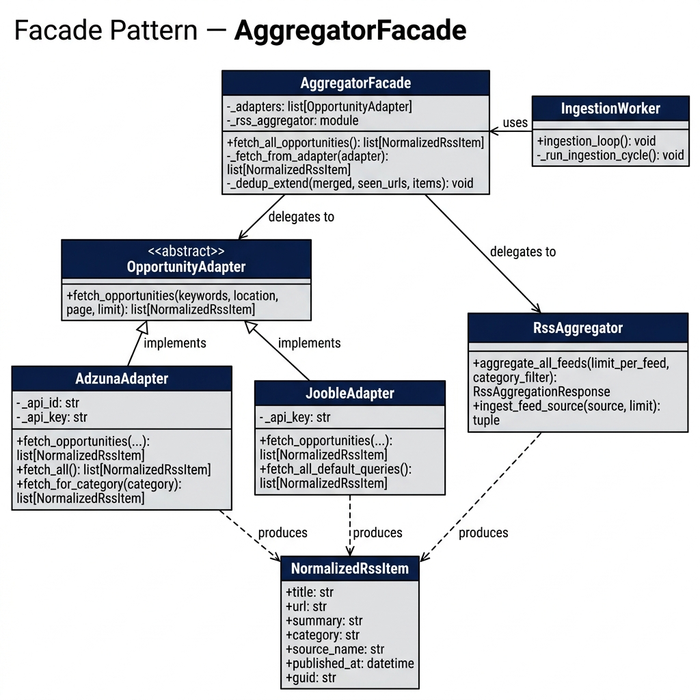
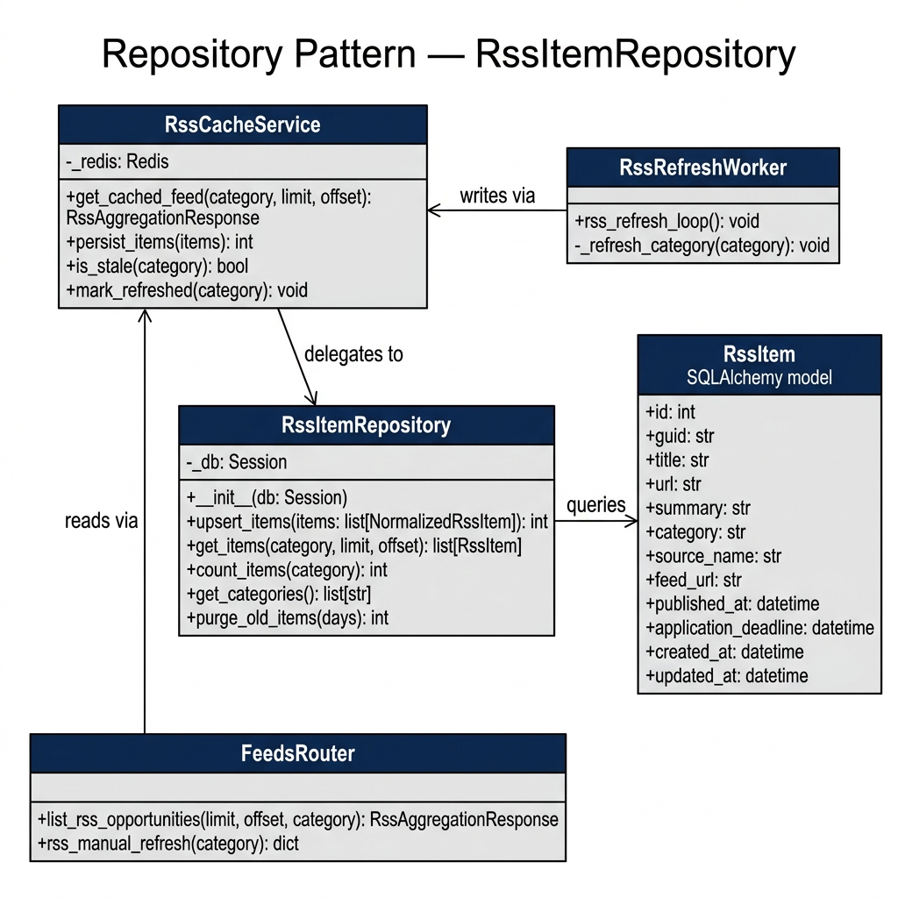

# Design Patterns — UniCompass

> **Project:** UniCompass — AI-powered opportunity discovery platform
> **Date:** 2026-04-18

---

## System Overview

Before diving into individual patterns, the diagram below shows how all components fit together across the full system.

### C4 Component Diagram


*Figure 1 — C4 Component Diagram. Blue = API Routers, Teal = Services, Green = Adapters & Repositories, Yellow = Data Stores, Grey = External Systems.*

---

### Data Flow Diagram


*Figure 2 — Data Flow: from external sources through normalization, filtering, deduplication, and storage, to the client.*

---

### Ingestion Pipeline Sequence


*Figure 3 — Sequence diagram showing the full ingestion cycle: async wake-up → facade → adapters → content filter → upsert → Redis TTL refresh.*

---

## Pattern 1: Facade Pattern — AggregatorFacade

### Intent

Provide a **single, simplified interface** to a complex subsystem of data source adapters. The `AggregatorFacade` hides the complexity of coordinating multiple heterogeneous data sources (RSS feeds, Adzuna API, Jooble API) behind a single `fetch_all_opportunities()` method.

### Problem

The ingestion pipeline must pull data from three different source types, each with different client interfaces, authentication schemes, response formats, and error models. Without a unifying layer, every consumer (background worker, admin endpoint, test suite) would need to know how to call each adapter individually, merge their results, and handle deduplication.

### Solution

`AggregatorFacade` encapsulates all source orchestration:

1. Iterates over registered adapters
2. Calls each adapter within a **fault-isolation try/except boundary**
3. Merges results with in-memory URL-based deduplication
4. Returns a single `list[NormalizedRssItem]`

```python
# Before (direct calls scattered across worker code)
rss_items    = aggregate_all_feeds(limit_per_feed=50).items
adzuna_items = AdzunaAdapter().fetch_all()
jooble_items = JoobleAdapter().fetch_all_default_queries()
all_items    = deduplicate(rss_items + adzuna_items + jooble_items)

# After (one call through the facade)
all_items = AggregatorFacade().fetch_all_opportunities()
```

### UML Class Diagram



*Figure 4 — UML Class Diagram: Facade Pattern. `AggregatorFacade` delegates to `RssAggregator` and multiple `OpportunityAdapter` implementations. All adapters produce the shared `NormalizedRssItem` schema.*

### Key Files

| File | Role |
|------|------|
| [`aggregator_facade.py`](../../backend/app/services/adapters/aggregator_facade.py) | Facade implementation |
| [`base_adapter.py`](../../backend/app/services/adapters/base_adapter.py) | Abstract `OpportunityAdapter` base class |
| [`jooble_adapter.py`](../../backend/app/services/adapters/jooble_adapter.py) | Jooble API adapter |
| [`adzuna_adapter.py`](../../backend/app/services/rss/adzuna_adapter.py) | Adzuna API adapter |
| [`aggregator.py`](../../backend/app/services/rss/aggregator.py) | RSS feed aggregator |
| [`ingestion_worker.py`](../../backend/app/workers/ingestion_worker.py) | Consumer of the facade |

### Consequences

| | Description |
|--|-------------|
| ✅ **Extensibility** | Adding a new data source requires only implementing `OpportunityAdapter` and registering it — zero changes to callers |
| ✅ **Testability** | The entire aggregation chain tested through one entry point; callers testable with a stub facade |
| ✅ **Fault isolation** | Per-adapter try/except ensures one failing source doesn't break others |
| ⚠️ **Single choke point** | If the facade itself fails unexpectedly, all sources fail together |

---

## Pattern 2: Repository Pattern — RssItemRepository

### Intent

Encapsulate all **data access logic** for a specific domain entity behind a clean interface. `RssItemRepository` owns all SQL queries for the `rss_items` table — reads, writes, counts, and cleanup.

### Problem

Multiple components need to interact with the `rss_items` table:
- The **ingestion worker** writes (upserts) new items
- The **feeds API router** reads items with filtering and pagination
- The **cache service** mediates reads with active-item and content filtering
- Future **analytics** features need aggregate queries

Without an abstraction, each component would contain raw SQLAlchemy queries — duplicating filtering logic, coupling business logic to the ORM, and making schema changes expensive.

### Solution

All DB operations for `rss_items` go through a single repository class:

```python
repo = RssItemRepository(db_session)

# Write path (ingestion worker)
repo.upsert_items(items)                             # ON CONFLICT DO UPDATE

# Read path (feeds API)
repo.get_items(category="hackathon", limit=50, offset=0)

# Observability
repo.count_items(category="research")
repo.get_categories()

# Maintenance
repo.purge_old_items(days=30)
```

### UML Class Diagram



*Figure 5 — UML Class Diagram: Repository Pattern. `RssItemRepository` centralizes all DB interaction. `RssCacheService` mediates between the `FeedsRouter`/`RssRefreshWorker` and the repository.*

### Key Files

| File | Role |
|------|------|
| [`rss_repository.py`](../../backend/app/repositories/rss_repository.py) | Repository implementation |
| [`rss_item.py`](../../backend/app/models/rss_item.py) | SQLAlchemy ORM model |
| [`cache_service.py`](../../backend/app/services/rss/cache_service.py) | Mediator between router and repository |
| [`feeds.py`](../../backend/app/routers/feeds.py) | API endpoints that read through the cache service |

### Consequences

| | Description |
|--|-------------|
| ✅ **Single source of truth** | Schema changes (column add, sort change) require edits in one place only |
| ✅ **Testability** | Worker and router tested with a mock repository — no real DB needed |
| ✅ **Consistency** | Ordering, pagination, and column selection are defined once and shared |
| ⚠️ **ORM coupling** | Switching ORMs requires rewriting the repository (but nothing else changes) |

---

## Supporting Patterns (documented in ADRs)

| Pattern | ADR | Where Used | NFR |
|---------|-----|-----------|-----|
| **Adapter** (OpportunityAdapter) | [ADR-002](../adr/adr-ingestion-pipeline.md#adr-002) | `base_adapter.py`, `jooble_adapter.py`, `adzuna_adapter.py` | Interoperability |
| **Two-layer Deduplication** | [ADR-003](../adr/adr-ingestion-pipeline.md#adr-003) | `aggregator_facade.py` + `rss_repository.py` | Data Integrity |
| **Idempotent Upsert** | [ADR-005](../adr/adr-ingestion-pipeline.md#adr-005) | `rss_repository.upsert_items()` | Reliability |
| **Background Task via Lifespan** | [ADR-007](../adr/adr-ingestion-pipeline.md#adr-007) | `main.py` lifespan + `ingestion_worker.py` | Availability |

---

## Pattern–NFR Mapping Summary

| Pattern | Primary NFR | How It Addresses the NFR |
|---------|------------|--------------------------|
| **Facade** | Maintainability, Extensibility | New data sources added by implementing one interface — no changes to callers |
| **Repository** | Testability, Separation of Concerns | All SQL centralized; schema changes touch one file; components mockable |
| **Adapter** | Interoperability | Provider-specific formats translated to shared `NormalizedRssItem` |
| **Idempotent Upsert** | Reliability | Re-running ingestion produces identical DB state — safe to restart |
| **Async Offloading** | Responsiveness | Event loop stays free while sync I/O runs in thread pool |
