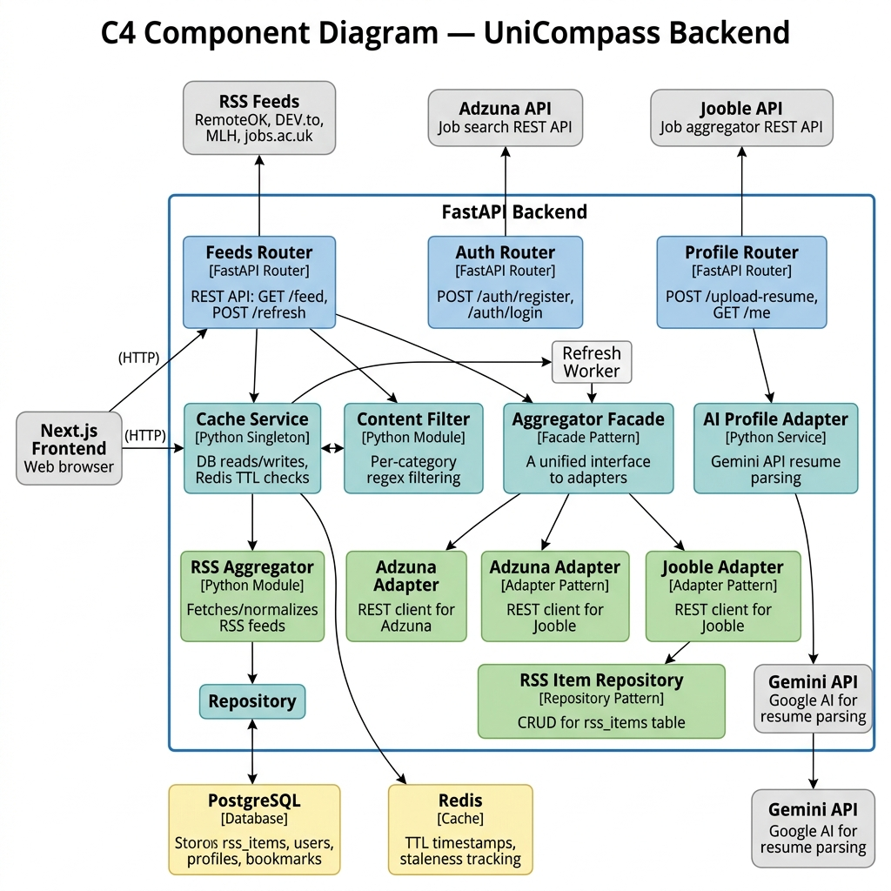
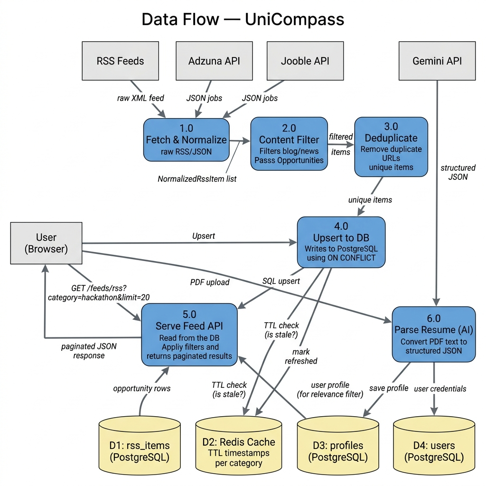
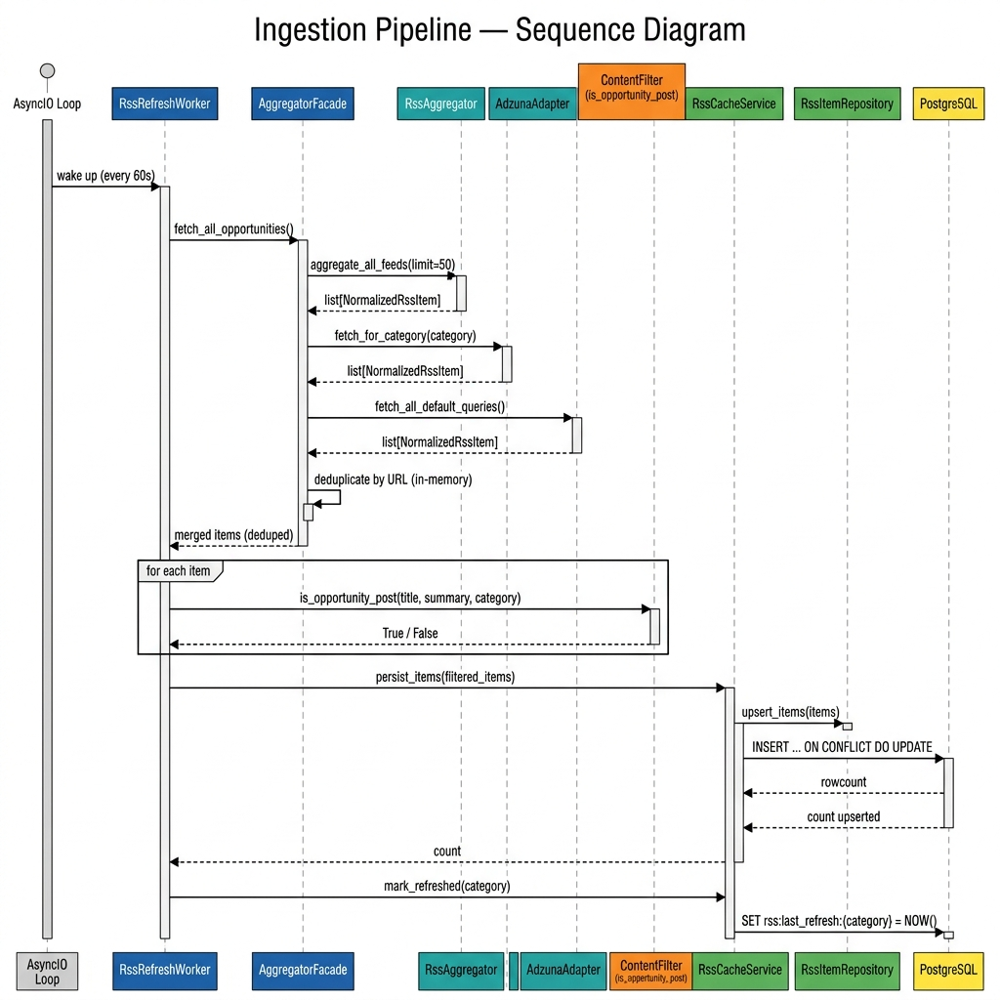

# Stakeholder Identification — IEEE 42010

> **Project:** UniCompass — AI-powered opportunity discovery platform
> **Standard:** ISO/IEC/IEEE 42010:2011 — Architecture Description
> **Date:** 2026-04-18

---

## 1. System Overview

UniCompass is a web-based platform that aggregates academic and career opportunities (internships, jobs, hackathons, research positions, freelance gigs) from multiple external sources (RSS feeds, Adzuna API, Jooble API), filters out non-opportunity content using per-category content rules, and presents a unified, searchable, and paginated feed. Users can upload a resume, which is parsed by an AI (Gemini) into a structured profile used for personalized feed ranking.

---

## 2. Stakeholders

| ID | Stakeholder | Role | Description |
|----|------------|------|-------------|
| S1 | **Undergraduate / Graduate Students** | End User | Primary consumers. Browse and filter the discovery feed for internships, hackathons, research openings, and jobs. Upload resumes for AI-parsed profiles. |
| S2 | **Researchers / Postgraduates** | End User | Search for PhD positions, postdoctoral fellowships, funded research programs, and lab openings. Require high-precision filtering to exclude blog articles. |
| S3 | **System Administrator** | Operator | Deploys and monitors the platform. Manages database migrations, Redis cache, and background worker health. Triggers manual feed refreshes when needed. |
| S4 | **Development Team** | Developer / Maintainer | Extends the platform with new adapters, feed sources, filters, and frontend features. Needs clean separation of concerns and testable modules. |
| S5 | **External Data Providers** | Supplier | RSS feed publishers (RemoteOK, DEV Community, MLH, jobs.ac.uk, etc.), Adzuna API, and Jooble API. Provide raw opportunity data consumed by the ingestion pipeline. |
| S6 | **University / Course Instructor** | Acquirer / Evaluator | Evaluates the system's architecture for software engineering principles: design patterns, tactics, maintainability, and extensibility. |

---

## 3. Concerns

| ID | Concern | Description | Affected Stakeholders |
|----|---------|-------------|-----------------------|
| C1 | **Data Quality** | The feed must show only real opportunities — not blog articles, news, tutorials, or experience posts. | S1, S2, S6 |
| C2 | **Data Freshness** | Opportunities must be current. Expired listings and past events should not appear. | S1, S2 |
| C3 | **Performance** | Feed queries and page loads must be fast (< 2s response time at p95). | S1, S2, S3 |
| C4 | **Extensibility** | Adding a new data source (e.g., LinkedIn, Semantic Scholar) should require minimal code changes. | S4, S6 |
| C5 | **Reliability** | The ingestion pipeline must tolerate individual source failures without losing data from other sources. | S3, S4 |
| C6 | **Data Integrity** | Duplicate opportunities from multiple sources must be merged, not duplicated. Re-ingestion must be idempotent. | S1, S3 |
| C7 | **Security** | User credentials and sessions must be protected. API endpoints must require authentication. | S1, S2, S3 |
| C8 | **Deployability** | The system must be straightforward to deploy and operate with minimal infrastructure. | S3 |
| C9 | **Testability** | Components must be independently testable to support CI/CD and iterative development. | S4, S6 |
| C10 | **Usability** | The feed must support intuitive filtering, pagination, and category-based browsing. Profile upload must be simple. | S1, S2 |

---

## 4. Architecture Viewpoints

| Viewpoint | Purpose | Audience | Notation |
|-----------|---------|----------|----------|
| **Functional Viewpoint** | Describes the system's major functional components, their responsibilities, and how they interact. | S4, S6 | C4 Component Diagram, UML Class Diagrams |
| **Data Viewpoint** | Describes the data model, data flow from external sources through ingestion to the database, and caching layers. | S4, S3, S6 | Data Flow Diagram, ER Diagram |
| **Deployment Viewpoint** | Describes the runtime infrastructure: FastAPI server, PostgreSQL, Redis, and background workers. | S3, S4 | C4 Deployment Diagram |
| **Security Viewpoint** | Describes authentication (JWT), middleware authorization, and password hashing (bcrypt). | S1, S3, S7 | Sequence Diagram |

---

## 5. Architecture Views

### 5.1 Functional View

The system is decomposed into five major functional components:



*Figure 1 — C4 Component Diagram showing all system components, their roles, and communication paths.*

| Component | Responsibility | Key Files |
|-----------|---------------|-----------|
| **Frontend** | User interface — feed browsing, filtering, pagination, profile upload | `frontend/src/app/feed/`, `frontend/src/app/profile/` |
| **API Gateway** | REST endpoints for feed, auth, profile | `routers/feeds.py`, `routers/auth.py`, `routers/profile.py` |
| **Ingestion Pipeline** | Fetches, normalizes, deduplicates, and persists opportunities | `services/rss/aggregator.py`, `services/adapters/aggregator_facade.py`, `workers/` |
| **Content Filter** | Per-category pattern matching to reject blog/news content | `services/rss/filter.py` |
| **Auth Module** | Registration, login, JWT issuance, middleware-based route protection | `routers/auth.py`, `middleware/auth.py` |
| **Cache Service** | Redis TTL-based staleness tracking + DB read/write mediation | `services/rss/cache_service.py` |

**Concerns addressed:** C1 (data quality), C3 (performance), C4 (extensibility), C7 (security), C10 (usability)

---

### 5.2 Data View

**Data Flow:**



*Figure 2 — Data flow from external sources through normalization, filtering, and deduplication to PostgreSQL, and from the DB to the client.*

**Ingestion Sequence:**



*Figure 3 — Sequence diagram of the background ingestion cycle: RSS + Adzuna + Jooble → content filter → upsert → Redis TTL.*

**Key data entities:**

| Entity | Table | Purpose |
|--------|-------|---------|
| `RssItem` | `rss_items` | Stores normalized opportunities with guid, url, title, summary, category, source, timestamps |
| `User` | `users` | Stores credentials (bcrypt-hashed password), name, email |
| `Profile` | `profiles` | AI-parsed resume data: skills, education, experience, interests |
| `Bookmark` | `bookmarks` | User-to-opportunity relationship |

**Concerns addressed:** C2 (freshness), C5 (reliability), C6 (integrity)

---

### 5.3 Deployment View

```
┌──────────────────────────────────────────────────────────┐
│                     Host Machine                         │
│                                                          │
│  ┌────────────┐  ┌──────────────┐  ┌──────────────────┐  │
│  │  Next.js    │  │   FastAPI     │  │  Background      │  │
│  │  Dev Server │  │   (uvicorn)   │  │  Worker          │  │
│  │  Port 3000  │  │   Port 8000   │  │  (in-process)    │  │
│  └─────┬──────┘  └──────┬───────┘  └────────┬─────────┘  │
│        │                │                    │            │
│        │     ┌──────────┴────────────────────┘            │
│        │     │                                            │
│        │     ▼                                            │
│        │  ┌──────────────┐  ┌──────────────┐              │
│        │  │ PostgreSQL   │  │    Redis      │              │
│        │  │ Port 5432    │  │  Port 6379    │              │
│        │  └──────────────┘  └──────────────┘              │
│        │                                                  │
│        └──▶ Proxies API calls to FastAPI (port 8000)      │
└──────────────────────────────────────────────────────────┘
```

**Concerns addressed:** C8 (deployability), C3 (performance)

---

### 5.4 Security View

**Authentication Flow:**

```
User                 Frontend              Backend (FastAPI)         PostgreSQL
 │                      │                        │                       │
 │── Register ─────────▶│── POST /auth/register ▶│── Hash password ──────▶│
 │                      │                        │   (bcrypt)             │
 │── Login ────────────▶│── POST /auth/login ───▶│── Verify bcrypt ──────▶│
 │                      │◀── JWT token ──────────│                       │
 │                      │                        │                       │
 │── Browse Feed ──────▶│── GET /feed ──────────▶│── Validate JWT ───────│
 │                      │   (Bearer token)       │   (middleware/auth.py) │
 │                      │◀── 200 Feed Data ──────│                       │
 │                      │                        │                       │
 │── (No token) ───────▶│── GET /feed ──────────▶│── 401 Unauthorized ──▶│
```

**Concerns addressed:** C7 (security)

---

## 6. Concern–Viewpoint Traceability Matrix

| Concern | Functional | Data | Deployment | Security |
|---------|:----------:|:----:|:----------:|:--------:|
| C1 Data Quality | ✓ | | | |
| C2 Data Freshness | | ✓ | | |
| C3 Performance | ✓ | | ✓ | |
| C4 Extensibility | ✓ | | | |
| C5 Reliability | | ✓ | | |
| C6 Data Integrity | | ✓ | | |
| C7 Security | | | | ✓ |
| C8 Deployability | | | ✓ | |
| C9 Testability | ✓ | | | |
| C10 Usability | ✓ | | | |
