# Task 3: Architectural Tactics and Patterns

**Project:** UniCompass — AI-Powered Opportunity Discovery Platform  
**Domain:** Education / EdTech Discovery  
**Standard References:** Bass, Clements & Kazman — *Software Architecture in Practice* (Tactics); GoF Design Patterns; C4 Model

---

## Part 1: Architectural Tactics

> An **architectural tactic** is a design decision that directly affects the system's response to a quality attribute stimulus. Each tactic below is mapped to one or more Non-Functional Requirements (NFRs) from Task 1.

---

### Tactic 1 — Cache-Aside (Read-Through Caching) for Performance

**Quality Attribute Addressed:** Performance (NFR-1: Discovery feed < 200 ms)

**Description:**

The Cache-Aside (also called Lazy Loading) tactic places a fast in-memory store (Redis) between the application and the primary data store (PostgreSQL). When a request arrives, the system first checks Redis for a pre-computed result. Only on a cache miss does it query the database, after which the result is stored in Redis for subsequent requests.

This is the single most impactful tactic for UniCompass because the Discovery Feed (`GET /api/feeds/rss`) is the most frequently accessed endpoint. Without caching, every page load involves a full PostgreSQL table scan, optional pgvector similarity computation, and serialization — potentially 500–1500 ms. With caching, warm responses are served in < 200 ms, satisfying NFR-1.

**Tactic Applied In UniCompass:**

| Cache Layer        | Redis Key Pattern                           | TTL            | Invalidation Trigger        |
| ------------------ | ------------------------------------------- | -------------- | --------------------------- |
| Discovery Feed     | `feed:{category}:{active}:{limit}:{offset}` | 5 min (300s)   | Ingestion worker completion |
| Single Opportunity | `opportunity:{item_id}`                     | 30 min (1800s) | Time-based expiry           |
| User Profile       | `profile:{user_id}`                         | 1 hour (3600s) | Resume re-upload            |
| External API Raw   | `source:{name}:latest`                      | 30 min         | Time-based expiry           |

**Graceful Degradation:** All Redis calls are wrapped in `try/except`. If Redis is unavailable, the system falls back transparently to PostgreSQL — ensuring availability is never sacrificed for performance.

**Flow Diagram:**

```
Client Request: GET /api/feeds/rss?category=internship
        │
        ▼
  ┌─────────────┐
  │  Redis      │──── HIT ──► Return cached JSON (< 200 ms) ──► Client
  │  Cache      │
  └──────┬──────┘
         │ MISS
         ▼
  ┌──────────────────┐
  │  PostgreSQL DB   │──────► Query + Filter + Sort (500–1500 ms)
  └──────┬───────────┘
         │
         ▼
  Store in Redis (TTL: 5 min)
         │
         ▼
  Return response to Client
```

---

### Tactic 2 — Asynchronous Decoupled Background Processing for Scalability

**Quality Attribute Addressed:** Scalability (NFR-2) + Availability (NFR-4)

**Description:**

Ingesting data from RSS feeds and external APIs (Adzuna, Jooble) involves long-running, network-bound I/O that can take several seconds per source. If ingestion ran synchronously on the main API thread, every background crawl would block all user requests for its duration — making the system completely unusably slow.

The **Asynchronous Processing** tactic decouples the ingestion pipeline from the request-handling pipeline. Two dedicated background worker tasks (`rss_refresh_loop` and `ingestion_loop`) run as non-blocking `asyncio.Task` objects within the FastAPI process. They are launched at startup via FastAPI's `lifespan` context manager and operate independently — the API remains fully responsive regardless of how long ingestion takes.

**Additional Scalability Benefit:** The Facade layer's per-adapter fault isolation means a slow or failed external API (e.g., Jooble rate-limit) does not cascade to delay other adapters. All adapters execute independently inside the facade loop.

**Tactic Applied In UniCompass:**

```
FastAPI Application (Uvicorn ASGI Server)
├── Main Thread: Handles HTTP requests (feeds, auth, profile)
│
├── asyncio.Task: rss_refresh_loop()
│     └── Periodically polls RSS feeds (Feedparser)
│     └── Upserts to PostgreSQL
│     └── Invalidates Redis feed:* keys
│
└── asyncio.Task: ingestion_loop()
      └── Orchestrates AggregatorFacade.fetch_all_opportunities()
      └── Deduplicates by source URL
      └── Generates embeddings (Sentence-Transformers)
      └── Publishes match events to Redis Pub/Sub
```

Workers are gracefully cancelled on application shutdown via `asyncio.CancelledError` handling in the lifespan context, preventing orphaned background tasks.

---

### Tactic 3 — Fault Isolation via Adapter-Level Exception Handling for Availability

**Quality Attribute Addressed:** Availability (NFR-4)

**Description:**

UniCompass depends on multiple third-party services: Adzuna API, Jooble API, Internshala RSS, HackerEarth RSS, Google Gemini API, and Semantic Scholar API. Any of these can fail at any time due to rate limits, server outages, or network timeouts.

The **Fault Isolation** tactic ensures that a failure in one external service does not propagate to crash the ingestion pipeline, block user-facing endpoints, or corrupt the database state. This is implemented at two levels:

1. **Adapter-Level Isolation:** Each adapter's `fetch_opportunities()` call inside `AggregatorFacade` is wrapped in an independent `try/except` block. A Jooble outage logs an error but does not prevent the AdzunaAdapter or RSSAdapter from contributing their results.

2. **Cache-Level Graceful Degradation:** The `RedisCacheService` wraps every Redis operation (`GET`, `SET`, `DELETE`) in `try/except`. A Redis crash causes cache misses (worse performance) but never a 500 error — the system degrades gracefully to direct DB queries.

**Before (without fault isolation):**
```
Ingestion worker → [Jooble API fails] → Exception propagates → Entire worker crashes
         → No new data until worker restart → All RSS adapters also fail
```

**After (with fault isolation):**
```
Ingestion worker
  ├── RSSAdapter.fetch()    → OK (200 items)
  ├── AdzunaAdapter.fetch() → OK (50 items)
  └── JoobleAdapter.fetch() → FAIL → log error, continue
         → 250 items successfully ingested despite Jooble failure
```

This tactic directly implements the "Limit Fault Propagation" availability pattern from Bass et al.

---

### Tactic 4 — URL-Based Deduplication for Data Integrity

**Quality Attribute Addressed:** Data Integrity / Deduplication (NFR-5)

**Description:**

UniCompass scrapes the same opportunities from multiple overlapping sources — an internship may appear in both an RSS feed and the Adzuna API. Storing duplicates would degrade the user experience (repeated cards), waste storage, and skew relevance rankings.

The **Deduplication** tactic is applied at two layers:

**Layer 1 — In-Memory Dedup (AggregatorFacade):**  
During each ingestion cycle, the facade maintains a `seen_urls: set[str]` dictionary. As items are collected from each adapter, any item whose `source_url` already appears in `seen_urls` is discarded. This is an O(1) lookup per item.

**Layer 2 — Database Constraint Dedup:**  
The PostgreSQL `rss_items` table has a `UNIQUE` constraint on the `url` column. The ingestion worker uses `INSERT ... ON CONFLICT DO NOTHING` semantics (via SQLAlchemy `upsert`), so even if the in-memory dedup misses a duplicate (e.g., after a worker restart), the database constraint acts as the final guard.

**Result:** No matter how many sources surface the same opportunity, it appears exactly once in the discovery feed, satisfying NFR-5 completely.

---

### Tactic 5 — Semantic Vector Indexing for Accuracy and Relevance

**Quality Attribute Addressed:** Accuracy / Relevance (NFR-3)

**Description:**

Traditional keyword search ranks opportunities by exact term matches — a student who lists "ML" on their profile would miss listings that say "Machine Learning" without the abbreviation. The **Semantic Vector Indexing** tactic replaces keyword matching with dense vector embeddings, capturing meaning rather than surface text.

**How it works in UniCompass:**
1. When a new opportunity is ingested, its title + description text is encoded into a 384-dimensional vector by `all-MiniLM-L6-v2` (Sentence-Transformers).
2. When a user uploads a resume and Gemini extracts their skills/interests, those are similarly encoded into a 384-dimensional user profile vector.
3. When the user requests the feed with `sort=relevant`, the system computes **cosine similarity** between the user's profile vector and all opportunity vectors using pgvector's `<=>` operator.
4. Opportunities are returned ranked by descending similarity score.

**pgvector Optimization:** A HNSW (Hierarchical Navigable Small World) index on the embedding column enables approximate nearest-neighbour search in sub-linear time — critical for maintaining responsiveness as the opportunities table grows.

```
User Profile Embedding (384-dim vector):
  [0.12, -0.87, 0.43, ..., 0.91]              → "Python, ML, Data Science"

Opportunity Embedding (384-dim vector):
  [0.15, -0.82, 0.40, ..., 0.88]              → "Machine Learning Intern at DataCo"

Cosine Similarity: 0.97  ← HIGH RELEVANCE → Ranked #1 in user's feed

vs.

Opportunity Embedding:
  [0.67, 0.21, -0.55, ..., -0.33]             → "Marketing Intern at BrandCo"
Cosine Similarity: 0.23  ← LOW RELEVANCE → Ranked #120 in user's feed
```

This tactic directly addresses NFR-3 and is what distinguishes UniCompass from a simple aggregator.

---

## Part 2: Implementation Patterns

> **Two primary design patterns** are described below in full detail with UML diagrams. A third pattern (Strategy) is also documented as a supporting pattern.

---

### Pattern 1 — Facade + Adapter Pattern (Ingestion Engine)

#### 2.1 Pattern Overview

| Attribute                   | Details                                                                                                                                                                                                                         |
| --------------------------- | ------------------------------------------------------------------------------------------------------------------------------------------------------------------------------------------------------------------------------- |
| **Pattern Family**          | Structural (Gang of Four)                                                                                                                                                                                                       |
| **Pattern Names**           | Facade (GoF) + Adapter (GoF) — used together                                                                                                                                                                                    |
| **Problem Solved**          | How to aggregate opportunity data from N heterogeneous external sources (RSS XML, Adzuna JSON, Jooble JSON, Semantic Scholar JSON) into a single, normalized data model without coupling business logic to each source's schema |
| **Component Where Applied** | Ingestion Engine — `AggregatorFacade`, `OpportunityAdapter`, `RSSAdapter`, `AdzunaAdapter`, `JoobleAdapter`                                                                                                                     |
| **NFR Addressed**           | NFR-2 Scalability (new sources = new adapter, zero existing changes); NFR-4 Availability (per-adapter fault isolation)                                                                                                          |

#### 2.2 How The Pattern Works In UniCompass

**The Adapter** converts each source's proprietary format into the system's canonical `NormalizedRssItem` schema:
- `RSSAdapter` parses Feedparser's `FeedParserDict` entry objects
- `AdzunaAdapter` parses Adzuna's REST JSON response (`{results: [...]}`)
- `JoobleAdapter` parses Jooble's REST JSON response (`{jobs: [...]}`)

All adapters implement the `OpportunityAdapter` abstract base class (ABC), which declares a single contract: `fetch_opportunities() -> List[NormalizedRssItem]`.

**The Facade** (`AggregatorFacade`) provides a single entry point — `fetch_all_opportunities()` — that calls all adapters, merges results into one list, and deduplicates by source URL. The ingestion worker, background tasks, and any API endpoint that needs opportunities call only the facade — they have zero knowledge of individual adapters or external source formats.

#### 2.3 UML Class Diagram — Facade + Adapter Pattern


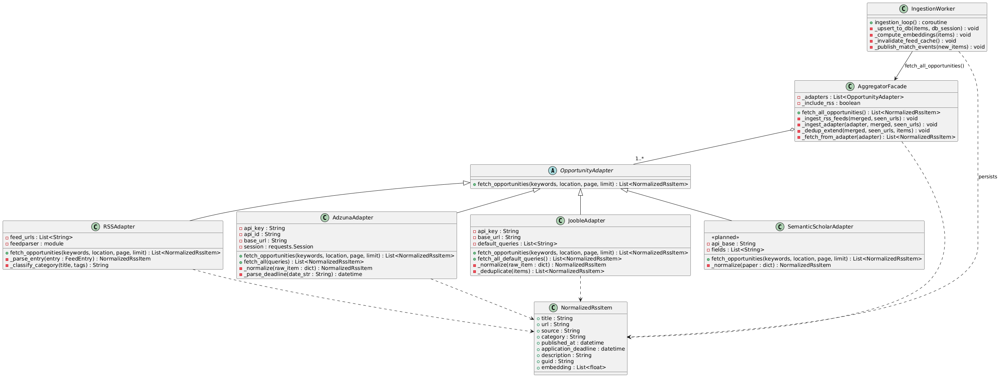

---

#### 2.4 UML Sequence Diagram — Ingestion Cycle with Facade + Adapter
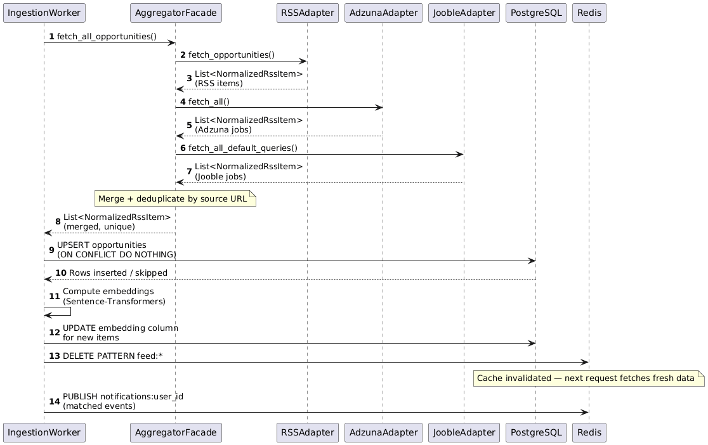

---

#### 2.5 C4 Model Diagrams (Facade + Adapter)

> **C4 Level 1 — System Context:** Positions UniCompass within its environment — who uses it and which external systems it depends on for opportunity data.

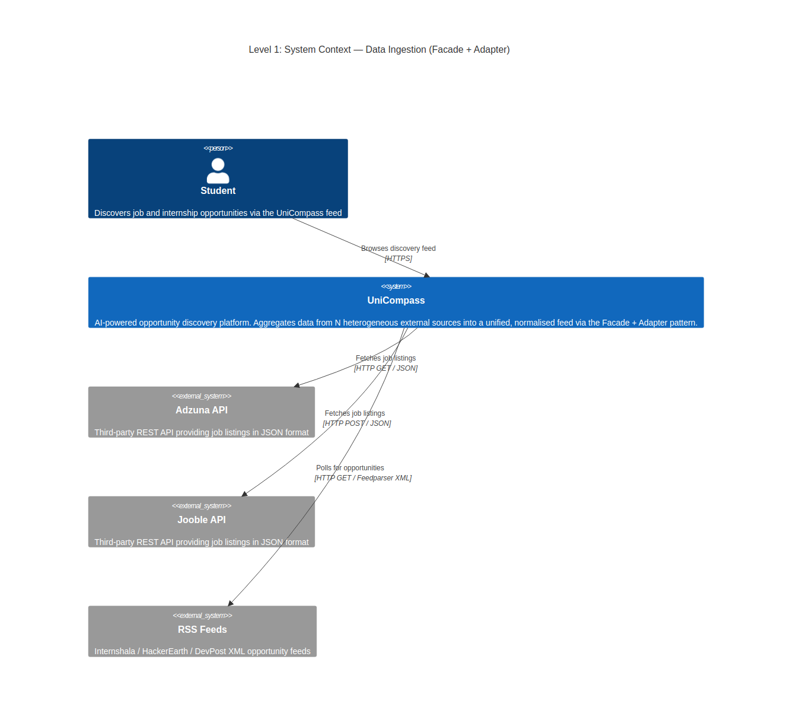

> **C4 Level 2 — Container Diagram:** Shows the top-level deployable units (Frontend, Backend, Ingestion Engine, PostgreSQL, Redis) and how they communicate during an ingestion cycle.

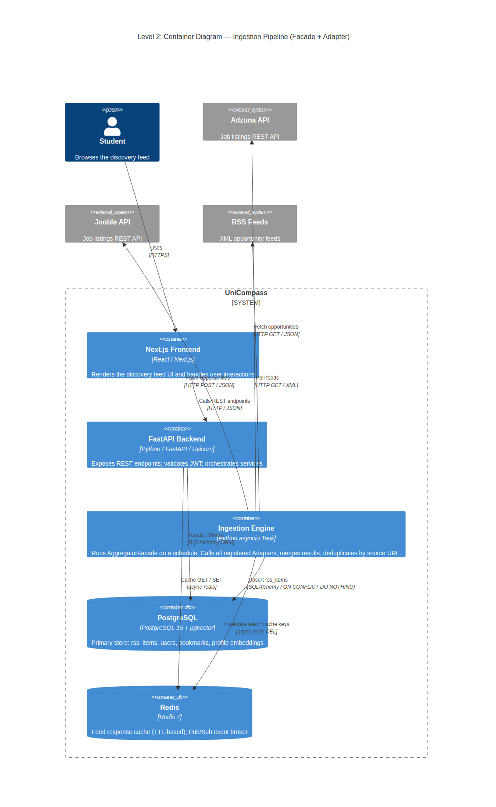

> **C4 Level 3 — Component Diagram:** Zooms into the Ingestion Engine container, revealing the internal structure: `AggregatorFacade`, the `OpportunityAdapter` interface, three concrete adapters, and the `NormalizedRssItem` output schema.

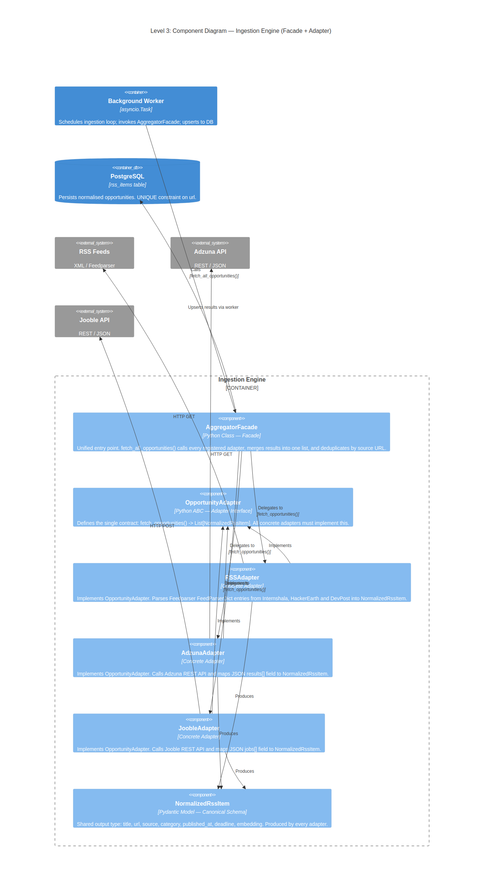

---

#### 2.5 Open/Closed Principle: Adding a New Source

Adding **Semantic Scholar** as a new source requires:
1. Create `SemanticScholarAdapter(OpportunityAdapter)` with its own `fetch_opportunities()`.
2. Register it in `AggregatorFacade.__init__()`: `self._adapters.append(SemanticScholarAdapter())`.
3. **Zero changes** to the ingestion worker, feed endpoints, database layer, or any other component.

---

### Pattern 2 — Observer / Publish-Subscribe Pattern (Real-Time Notifications)

#### 2.6 Pattern Overview

| Attribute                   | Details                                                                                                                                                                                                |
| --------------------------- | ------------------------------------------------------------------------------------------------------------------------------------------------------------------------------------------------------ |
| **Pattern Family**          | Behavioural (Gang of Four) / Architectural (Event-Driven)                                                                                                                                              |
| **Pattern Names**           | Observer (GoF) + Publish-Subscribe (Architectural)                                                                                                                                                     |
| **Problem Solved**          | How to push time-sensitive opportunity alerts to users in real-time without polling, without coupling the ingestion worker to individual WebSocket connections, and without blocking the data pipeline |
| **Component Where Applied** | Notification Service — Redis Pub/Sub broker + FastAPI WebSocket endpoint                                                                                                                               |
| **NFR Addressed**           | NFR-4 Availability (decoupled delivery); NFR-1 Performance (push model, ~50ms delivery vs polling's N-second delay)                                                                                    |

#### 2.7 How The Pattern Works In UniCompass

The classic **Observer** pattern defines a one-to-many dependency such that when a subject (Publisher) changes state, all registered dependents (Observers) are notified automatically. UniCompass extends this with a **message broker** (Redis Pub/Sub) to fully decouple the Publisher and Observers — neither needs to know about the other's existence.

**Publisher (Concrete Subject):** The `IngestionWorker`. After detecting a new opportunity that exceeds a relevance threshold for a user, it publishes a JSON payload to a Redis channel (`notifications:{user_id}`) using `PUBLISH`.

**Broker (Event Channel):** Redis Pub/Sub. Channels are per-user (`notifications:u1`, `notifications:u2`, etc.), enabling targeted, single-user notifications without broadcasting to all connected clients.

**Observer (Concrete Observer):** The FastAPI WebSocket handler (`/ws/notifications`). It subscribes to the user-specific Redis channel. When a message arrives, it forwards it over the WebSocket connection to the browser. The frontend JavaScript listener updates the notification bell badge and shows a toast alert.

**Key Decoupling Benefit:** The Ingestion Worker publishes to Redis and immediately continues ingesting — it never blocks waiting for WebSocket clients. If a user is offline, events are queued in Redis; when they reconnect, they receive any pending notifications.

#### 2.8 UML Class Diagram — Observer / Pub-Sub Pattern

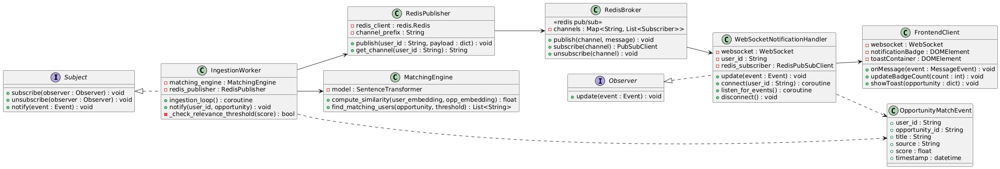

---

#### 2.10 UML Sequence Diagram — WebSocket Connection Lifecycle
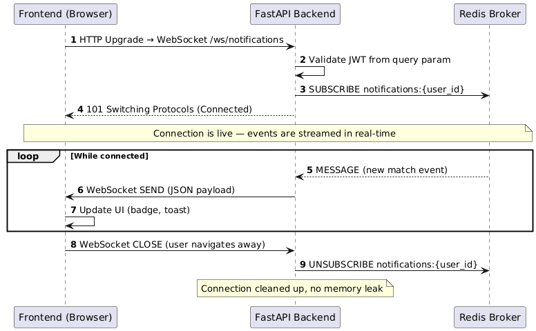

---

#### 2.11 C4 Model Diagrams (Observer / Pub-Sub)

> **C4 Level 1 — System Context:** Shows the student receiving real-time push alerts from UniCompass, and the external data sources that trigger new opportunity events.

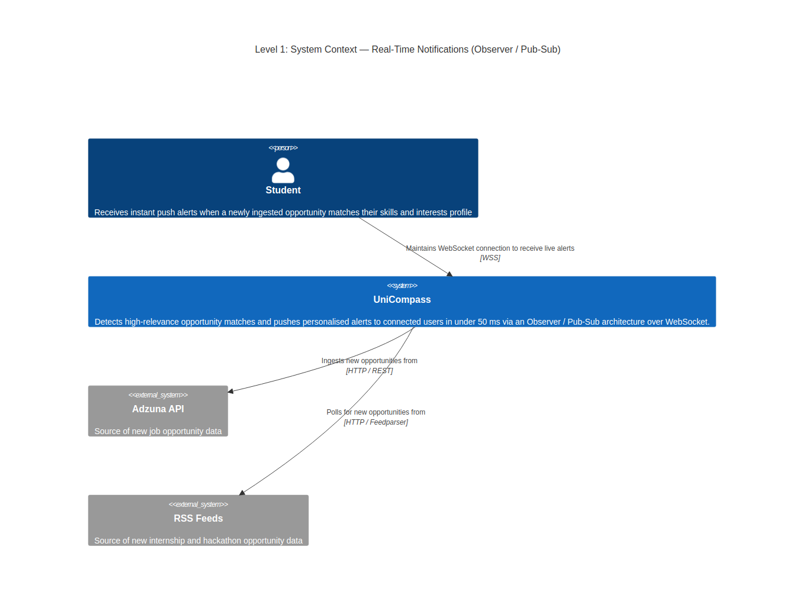

> **C4 Level 2 — Container Diagram:** Maps the Publisher (Ingestion Worker), Broker (Redis Pub/Sub), Observer (WebSocket Server), and Frontend containers and the event flow between them.

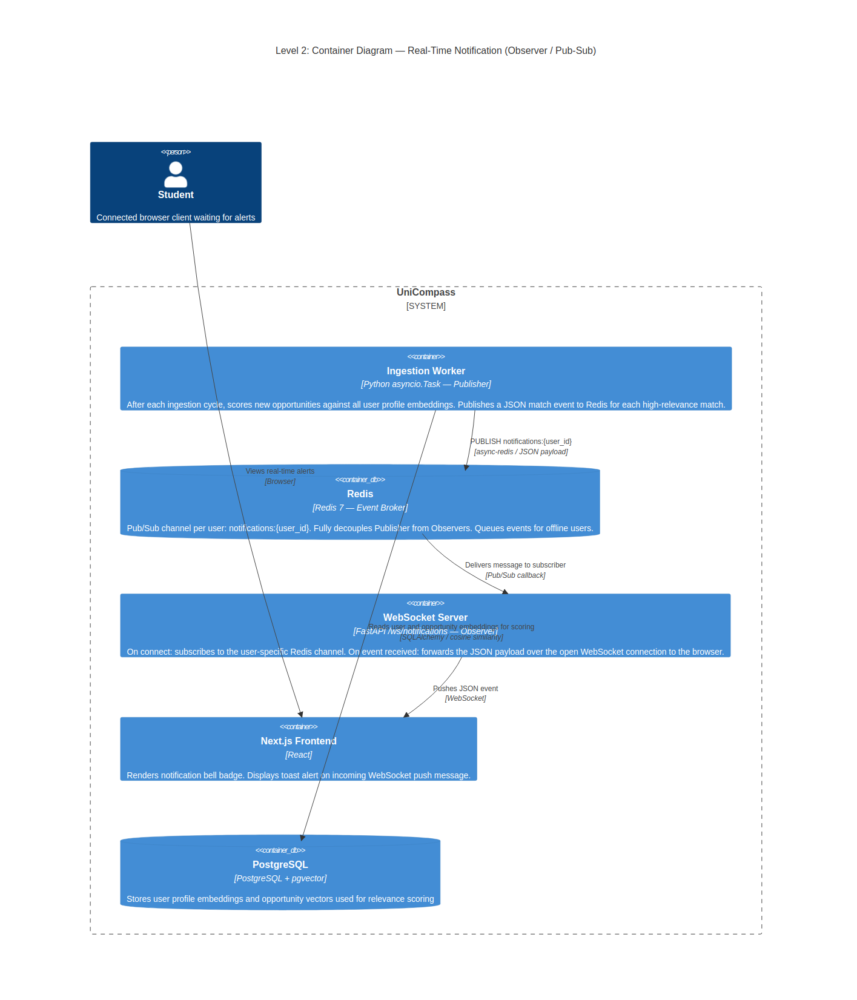

> **C4 Level 3 — Component Diagram:** Zooms into the Notification Service, showing `IngestionWorker` (Subject), `Redis Pub/Sub Channel` (Broker), `WebSocket Handler` (Observer), and `NotificationManager` (Connection Registry).

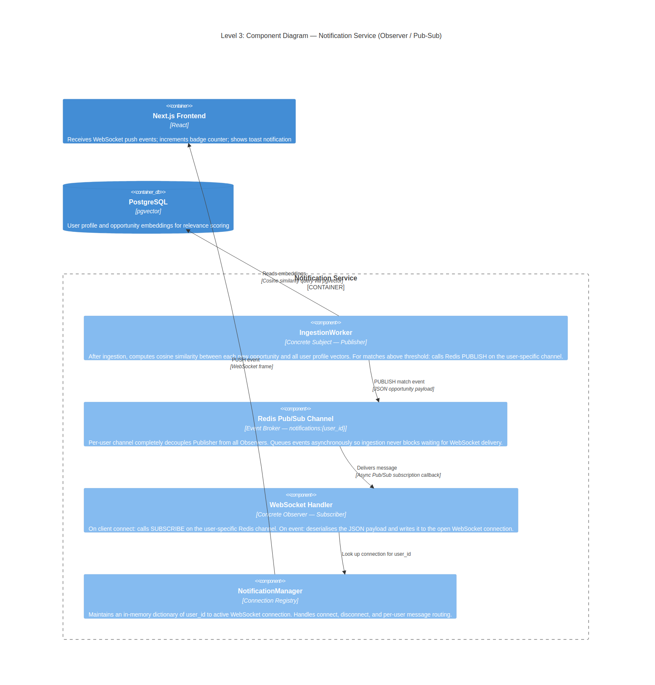

---

### Pattern 3 (Supporting) — Strategy Pattern (Feed Sorting)

#### 2.11 Overview

The **Strategy** pattern is used to make the feed sorting algorithm a first-class, swappable concern. Instead of a giant `if sort == "latest": ... elif sort == "relevant": ...` block in the route handler, each sorting algorithm is encapsulated in its own class implementing a common interface.

| Strategy                | Trigger                            | Algorithm                                                                |
| ----------------------- | ---------------------------------- | ------------------------------------------------------------------------ |
| `LatestSortStrategy`    | `sort=latest` (default)            | `ORDER BY published_at DESC` in PostgreSQL                               |
| `RelevanceSortStrategy` | `sort=relevant` (requires profile) | pgvector `<=>` cosine similarity operator against user profile embedding |

#### 2.12 UML Class Diagram — Strategy Pattern

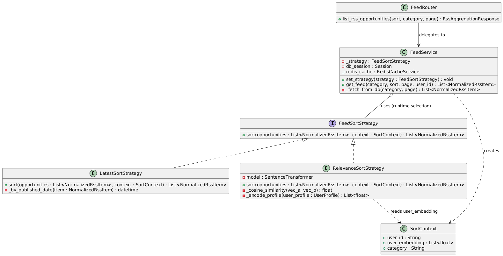

---

#### 2.13 C4 Model Diagrams (Strategy Pattern)

> **C4 Level 1 — System Context:** Shows the student requesting a personalised or chronological feed, and UniCompass's dependency on Gemini for building the profile embedding that powers relevance ranking.

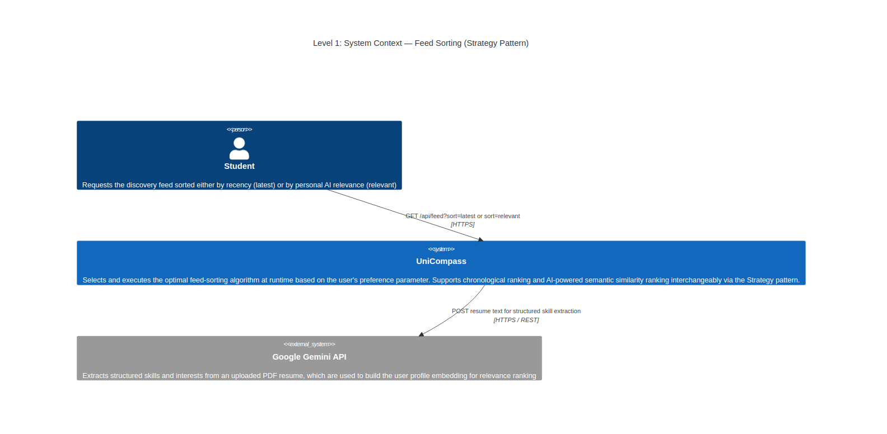

> **C4 Level 2 — Container Diagram:** Shows the FastAPI Backend selecting a sort strategy at runtime, with Redis as the cache layer and PostgreSQL (with HNSW index) as the data store.

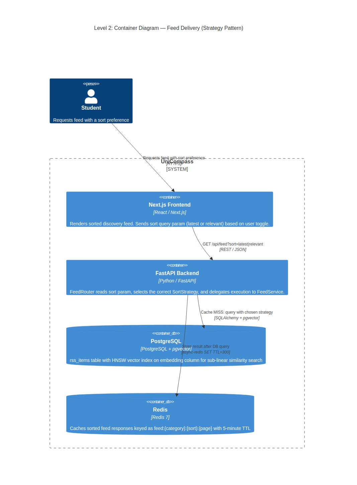

> **C4 Level 3 — Component Diagram:** Zooms into the Feed Service, revealing `FeedRouter` (client), `FeedService` (context), `SortStrategy` (interface), `LatestSortStrategy` and `RelevanceSortStrategy` (concrete strategies), and `RedisCacheService` (cache decorator).

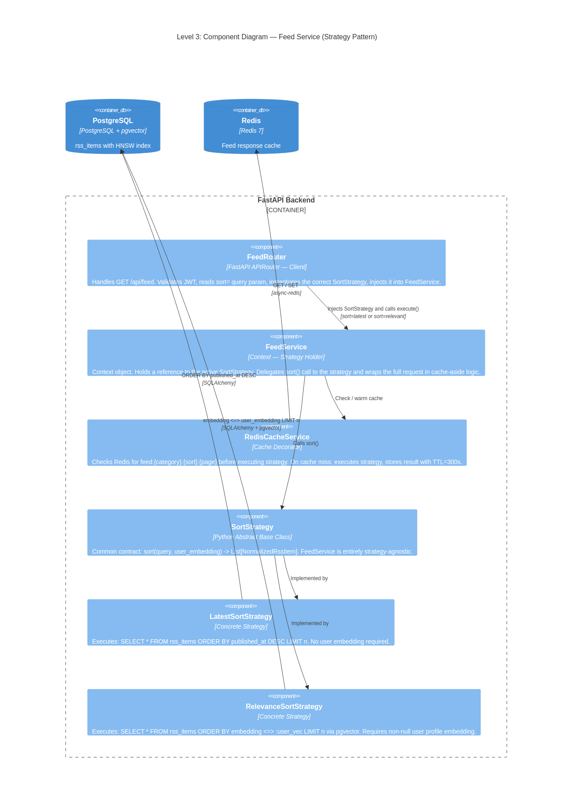

---

## Summary Table

### Architectural Tactics

| #   | Tactic                          | Category (Bass et al.)   | NFR Addressed       | Key Mechanism                                                        |
| --- | ------------------------------- | ------------------------ | ------------------- | -------------------------------------------------------------------- |
| 1   | **Cache-Aside (Redis)**         | Performance              | NFR-1 < 200 ms      | Redis key-value store; TTL-based expiry; event-driven invalidation   |
| 2   | **Async Background Processing** | Scalability              | NFR-2 Scalability   | `asyncio.Task` workers decoupled from API thread; non-blocking I/O   |
| 3   | **Fault Isolation**             | Availability             | NFR-4 Availability  | Per-adapter `try/except`; Redis fallback to DB; graceful degradation |
| 4   | **URL-Based Deduplication**     | Data Integrity           | NFR-5 Deduplication | In-memory `set` + DB `UNIQUE` constraint + `ON CONFLICT DO NOTHING`  |
| 5   | **Semantic Vector Indexing**    | Accuracy / Modifiability | NFR-3 Relevance     | `all-MiniLM-L6-v2` embeddings + pgvector HNSW cosine similarity      |

---

### Design Patterns

| #   | Pattern                   | GoF Category | Role In UniCompass                                                                             | UML Diagram         |
| --- | ------------------------- | ------------ | ---------------------------------------------------------------------------------------------- | ------------------- |
| 1   | **Facade + Adapter**      | Structural   | Unifies N heterogeneous external opportunity sources into one `fetch_all_opportunities()` call | Class + Sequence    |
| 2   | **Observer / Pub-Sub**    | Behavioural  | Decouples ingestion worker from WebSocket notification delivery via Redis broker               | Class + 2× Sequence |
| 3   | **Strategy** (supporting) | Behavioural  | Encapsulates feed sorting algorithms (latest vs. relevant) as interchangeable policies         | Class               |

---
