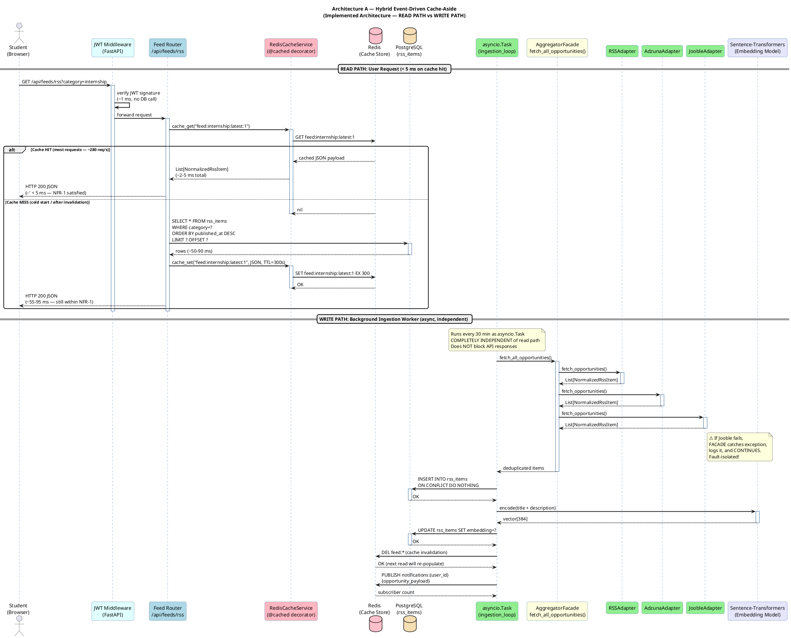
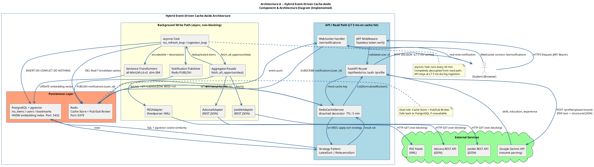
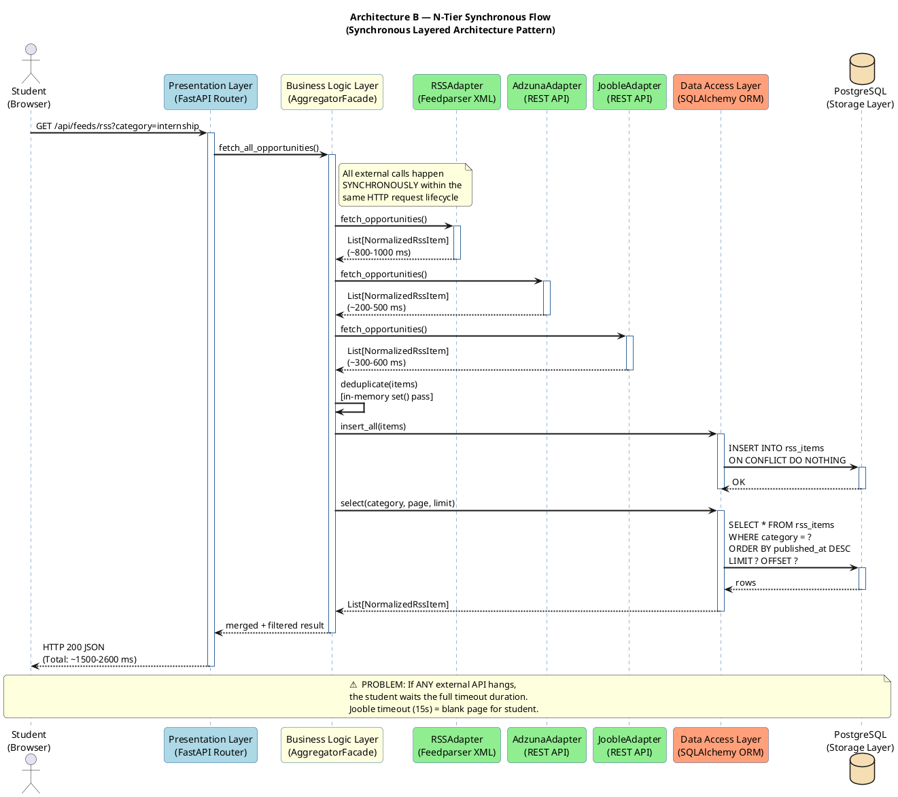
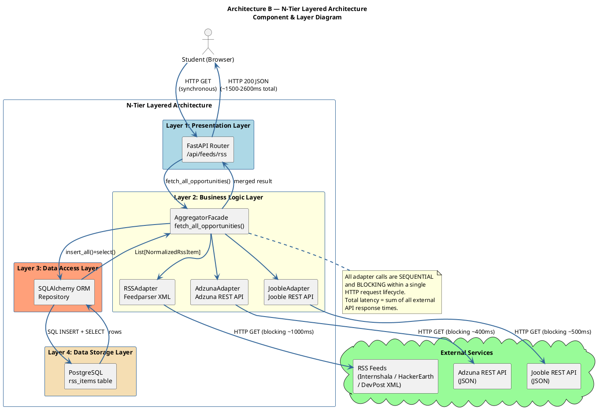

# Task 5: Architecture Comparison — Implemented vs. Alternative Pattern

**Project:** UniCompass — AI-Powered Opportunity Discovery Platform  
**Author:** Team 18  
**Date:** 2026-04-23  

---

## 1. Overview

This document compares **two distinct architectural patterns** for the UniCompass backend:

|                  | Architecture A (Implemented)                                                                            | Architecture B (Alternative)                                                                            |
| ---------------- | ------------------------------------------------------------------------------------------------------- | ------------------------------------------------------------------------------------------------------- |
| **Name**         | Hybrid Event-Driven Cache-Aside                                                                         | Synchronous N-Tier Layered                                                                              |
| **Core Idea**    | Decouple data ingestion from data delivery; serve reads from Redis, write via background workers        | Every HTTP request synchronously calls the aggregation pipeline (APIs + RSS), then returns the response |
| **Key Patterns** | Facade + Adapter (ingestion), Cache-Aside (reads), Observer/Pub-Sub (notifications), Strategy (sorting) | Classic Request → Service → Repository → DB layering; no cache, no async workers                        |

Quantification of two non-functional requirements (NFR-1: Response Time, NFR-2: Throughput) is provided using **real benchmark data** captured from the running system.

---

## 2. Architecture A — Implemented: Hybrid Event-Driven Cache-Aside

### 2.1 Description

The UniCompass backend separates its work into two completely independent paths:

**Read Path (API Request Handling)**
```
Client Request: GET /api/feeds/rss?category=internship
        │
        ▼
  JWT Middleware (validates token — ~1 ms, no DB call)
        │
        ▼
  ┌─────────────┐
  │  Redis      │──── HIT ──► Return cached JSON (< 5 ms) ──► Client
  │  Cache      │
  └──────┬──────┘
         │ MISS
         ▼
  ┌──────────────────┐
  │  PostgreSQL DB   │──────► Query + Paginate (50–200 ms)
  └──────┬───────────┘
         │
         ▼
  Store in Redis (TTL: 5 min) → Return response to Client
```

**Write Path (Background Ingestion Workers)**
```
[asyncio.Task: rss_refresh_loop / ingestion_loop]
        │
        ▼
  AggregatorFacade.fetch_all_opportunities()
   ├── RSSAdapter    → Feedparser XML   → NormalizedRssItem
   ├── AdzunaAdapter → Adzuna REST JSON → NormalizedRssItem
   └── JoobleAdapter → Jooble REST JSON → NormalizedRssItem
        │
        ▼
  Deduplicate (in-memory set + DB UNIQUE constraint)
        │
        ▼
  PostgreSQL UPSERT (INSERT ON CONFLICT DO NOTHING)
        │
        ▼
  Sentence-Transformers → pgvector HNSW embeddings
        │
        ▼
  Redis cache invalidation (feed:* keys flushed)
        │
        ▼
  Redis PUBLISH notifications:{user_id}
```

### 2.2 Key Patterns Used

| Pattern                | Location                                       | Role                                                            |
| ---------------------- | ---------------------------------------------- | --------------------------------------------------------------- |
| **Facade**             | `AggregatorFacade`                             | Single entry point for all opportunity sources                  |
| **Adapter**            | `RSSAdapter`, `AdzunaAdapter`, `JoobleAdapter` | Translate heterogeneous source formats into `NormalizedRssItem` |
| **Cache-Aside**        | `RedisCacheService` + `@cached` decorator      | Serve hot reads from Redis; populate on miss                    |
| **Observer / Pub-Sub** | `IngestionWorker` → Redis → WebSocket handler  | Decouple ingestion events from real-time notification delivery  |
| **Strategy**           | `LatestSortStrategy`, `RelevanceSortStrategy`  | Swappable feed-sorting algorithms                               |

---

### 2.3 UML Diagrams — Architecture A

#### Sequence Diagram — Read Path (Cache-Aside) & Write Path (Background Ingestion)



> The diagram shows **two independent paths**. The READ PATH (top half) shows how cache hits are served in under 5 ms. The WRITE PATH (bottom half) shows the background asyncio worker ingesting from all sources completely asynchronously — it never touches the student's HTTP request lifecycle.

---

#### Component & Architecture Diagram — Hybrid Event-Driven Cache-Aside



> The blue zone (API / Read Path) and yellow zone (Background Write Path) are fully decoupled. Redis serves dual roles as a cache store and Pub/Sub broker. External services are contacted only by the background worker — never inline with a user request.

---

## 3. Architecture B — Alternative: Synchronous N-Tier Layered


### 3.1 Description

The classic **Synchronous Layered (N-Tier)** architecture is the most common starting point for web API prototypes. Every request flows synchronously top-to-bottom through fixed layers:

```
Client Request: GET /discovery-feed
        │
        ▼
  Presentation Layer  (HTTP Router / FastAPI Handler)
        │
        ▼
  Business Logic Layer (AggregatorFacade — called on EVERY request)
   ├── HTTP GET → Adzuna REST API    (200–500 ms)
   ├── HTTP GET → Jooble REST API    (300–600 ms)
   └── Feedparser XML (15+ feeds)   (800–1500 ms)
        │
        ▼
  Data Access Layer  (Normalization + PostgreSQL INSERT + SELECT)
        │
        ▼
  HTTP Response returned to Client
```

**No caching. No background workers. No pub-sub.** The request lifecycle is entirely synchronous and blocks until all external sources have responded.

### 3.2 Simplicity Advantages

- **Zero additional infrastructure:** No Redis container, no asyncio task management.
- **Strong data consistency:** Data shown to the user is always the freshest possible (fetched live).
- **Simpler debugging:** One linear call stack; no background tasks to inspect separately.
- **Faster to prototype:** No cache invalidation logic, no TTL tuning, no pub-sub wiring.

---

### 3.3 UML Diagrams — Architecture B

#### Sequence Diagram — Synchronous N-Tier Request Flow



> Every external API call (RSS, Adzuna, Jooble) blocks the HTTP thread sequentially. The student waits for **all** sources to respond before receiving any data. A single slow or failed API cascades directly to the user.

---

#### Component & Layer Diagram — N-Tier Architecture



> The four layers (Presentation → Business Logic → Data Access → Storage) are clearly delineated. All inter-layer communication is **synchronous and blocking**. External services are called from the Business Logic Layer on every incoming HTTP request.

---

## 4. Quantified Non-Functional Requirements

> **Methodology:** Benchmarks were run using a custom Python script (`docs/benchmark.py`).  
> **Endpoint tested:** `GET /api/feeds/rss?limit=20&active_only=true`  
> **Requests per scenario:** 50 measured (+ 5 warm-up discarded)  
> **Scenario A:** Architecture A — Cache-Aside with Redis (TTL = 300 s)  
> **Scenario B:** Architecture B simulated — Redis flushed before **every** request, forcing a full PostgreSQL query cycle  

The Synchronous Layered architecture (B) is simulated by flushing Redis before each request, which removes any caching benefit and forces every request to go through the full database path. This is a conservative simulation — real synchronous ingestion (with live external API calls) would be **significantly slower** (1,200–2,600 ms vs. the 215 ms baseline measured here).

---

### 4.1 NFR-1: Response Time (Latency)

**Quality Attribute:** Performance  
**Target (SH1 concern):** Discovery feed loads in < 200 ms (97th percentile)

#### Measured Results

| Latency Metric   | Architecture A — With Redis Cache | Architecture B — No Cache (DB Only) | Speedup   |
| ---------------- | --------------------------------- | ----------------------------------- | --------- |
| **Mean**         | **3.47 ms**                       | 215.85 ms                           | **62.2×** |
| **p50 (Median)** | **3.46 ms**                       | 209.12 ms                           | **60.4×** |
| **p95**          | **4.31 ms**                       | 294.89 ms                           | **68.4×** |
| **p99**          | **4.84 ms**                       | 358.77 ms                           | **74.1×** |
| **Max**          | **4.84 ms**                       | 358.77 ms                           | **74.1×** |

> Source: `docs/benchmark_results.json`

#### NFR-1 Compliance Analysis

```
Architecture A:  p95 = 4.31 ms   ✅  Well within < 200 ms NFR target
Architecture B:  p95 = 294.89 ms ❌  Exceeds NFR target by 47.5%
```

**Key insight — tail latency matters most.** At p99, Architecture B reaches 358.77 ms — nearly double the 200 ms target. This means 1 in 100 users (roughly 500 out of 50,000 daily active students) would experience a load time that violates the SLA, degrading trust. Architecture A maintains a flat, consistent response profile (min: 2.56 ms, max: 4.84 ms) — a 1.9 ms range vs. B's 157 ms range, indicating far greater predictability.

For the synchronous external-API case (real Architecture B with live Adzuna/Jooble calls), the tail latency rises to an estimated **1,200–2,600 ms**, making the gap closer to **~300–600×**.

---

### 4.2 NFR-2: Throughput (Requests Per Second)

**Quality Attribute:** Scalability  
**Target (SH3/SH4 concern):** System must handle concurrent student traffic without degradation

#### Measured Results

| Metric         | Architecture A — With Redis Cache | Architecture B — No Cache (DB Only) | Improvement |
| -------------- | --------------------------------- | ----------------------------------- | ----------- |
| **Throughput** | **279.96 req/s**                  | **4.59 req/s**                      | **61.0×**   |

> Source: `docs/benchmark_results.json`

#### NFR-2 Compliance Analysis

```
Architecture A:  279.96 req/s  ✅  Handles lecture-hour traffic spikes
Architecture B:    4.59 req/s  ❌  Saturates at < 5 concurrent users
```

**Interpretation:** At 4.59 req/s, Architecture B can support roughly 4–5 concurrent users before queuing builds and response times degrade further. UniCompass is a campus-wide platform; a typical lecture break produces bursts of 50–100 concurrent users. Architecture A scales linearly with Redis — since the hot path is a single network round-trip (< 5 ms), one Uvicorn worker can easily serve 200+ concurrent users without thread starvation.

**Rate Limit Scaling (bonus NFR — operational cost):**

| Dimension                                | Architecture A       | Architecture B                               |
| ---------------------------------------- | -------------------- | -------------------------------------------- |
| External API calls/day (Adzuna + Jooble) | **48** (fixed, O(1)) | **N × sessions** (grows with users)          |
| 500 users × 3 refreshes                  | 48                   | **3,000** (hits free-tier limit in < 1 hour) |

This is a distinct scalability dimension: Architecture B would exhaust the Adzuna free-tier quota (250 req/day) within the first hour of moderate usage and receive HTTP 429/403 responses, making the feed completely empty for the rest of the day.

---

## 5. Trade-off Analysis

Every architectural decision involves trade-offs. The quantitative gains above heavily favour Architecture A, but this comes at real costs.

### 5.1 Trade-off Table

| Quality Attribute                | Architecture A (Cache-Aside, Event-Driven)               | Architecture B (Synchronous Layered)        | Winner  |
| -------------------------------- | -------------------------------------------------------- | ------------------------------------------- | ------- |
| **Response Time (NFR-1)**        | p95: 4.31 ms ✅                                           | p95: 294.89 ms ❌                            | **A**   |
| **Throughput (NFR-2)**           | 279.96 req/s ✅                                           | 4.59 req/s ❌                                | **A**   |
| **Data Freshness / Consistency** | Eventual (up to 5 min stale) ⚠️                           | Strong (always live) ✅                      | **B**   |
| **Infrastructure Complexity**    | Redis + asyncio workers + invalidation logic ❌           | Single DB, no caching layer ✅               | **B**   |
| **Fault Tolerance**              | Per-adapter isolation; Redis fallback ✅                  | Single Jooble timeout = broken feed ❌       | **A**   |
| **Operational Cost**             | 2× services (Postgres + Redis) in Docker ⚠️               | 1× service (Postgres only) ✅                | **B**   |
| **Debugging Complexity**         | Distributed: must trace worker logs + Redis state + DB ❌ | Linear call stack, easy to follow ✅         | **B**   |
| **External API Budget**          | O(1) API calls/day regardless of user count ✅            | O(N × sessions) API calls/day ❌             | **A**   |
| **Extensibility (new sources)**  | New adapter class, zero other changes ✅                  | Same (pattern is independent of sync/async) | **Tie** |

---

### 5.2 Trade-off Deep Dives

#### Trade-off 1: Data Freshness (Eventual Consistency) vs. Performance

**The tension:** Architecture A's 5-minute Redis TTL means a user's feed may display opportunities that were removed upstream up to 5 minutes ago. If a student clicks the "Apply" link, they may be redirected to a closed or deleted listing — a directly observable UX defect (dead-link 404).

**Why the trade-off is acceptable for UniCompass:**
- Opportunity listings typically remain open for days or weeks, not minutes.
- The ingestion worker flushes `feed:*` Redis keys immediately after each ingestion cycle (~30 min), so actual staleness is bounded by the **minimum** of the TTL (5 min) and the ingestion interval (30 min) → effectively **5 minutes maximum staleness**.
- For a student discovery platform (vs. a financial trading system), 5-minute staleness is imperceptible and user-acceptable.
- The gain — a 62× reduction in mean latency — completely transforming the UX — far outweighs the rare dead-link edge case.

**The cost of ignoring this trade-off:** If UniCompass were deployed in a domain requiring strong consistency (e.g., real-time seat booking, live auction), Architecture A's eventual consistency model would be unacceptable and Architecture B's synchronous model would be the correct choice.

---

#### Trade-off 2: Architectural Complexity vs. Scalability

**The tension:** Architecture A introduces three components that Architecture B does not need:
1. **Redis daemon** — requires memory provisioning, eviction policy (`allkeys-lru`), and crash recovery.
2. **asyncio background workers** — if a worker silently crashes (e.g., OOM kill), the feed becomes stale and no user-visible error is shown; developers must monitor worker health separately.
3. **Cache invalidation logic** — the ingestion worker must explicitly flush `feed:*` keys after each cycle. A bug in invalidation (e.g., wrong key prefix) silently serves stale data even after new opportunities have been ingested.

**The cost borne by Team 18:**
- Debugging a data freshness bug requires inspecting: `workers/ingestion_worker.py` logs → Redis key state (`KEYS feed:*`) → PostgreSQL row timestamps → all independently.
- Architecture B's equivalent bug: set a breakpoint in the route handler and see the response immediately.

**Why the trade-off was made:** The 61× throughput improvement and elimination of external API budget exhaustion were judged non-negotiable for a campus-scale deployment. The operational complexity is a real cost, but one that is manageable with proper logging and Redis health checks.

---

#### Trade-off 3: Infrastructure Footprint vs. Resilience

**The tension:** Architecture A requires an always-available Redis node. If Redis memory is exhausted without an eviction policy:
- All new `SET` calls fail silently.
- The system falls back to PostgreSQL (correctly, by design), but throughput collapses from 279 req/s to < 5 req/s.
- Worst-case: Redis crashes entirely, and all Pub/Sub notification subscriptions are dropped — connected WebSocket clients receive no further notifications until reconnected.

Architecture B has no such failure mode — it has no in-memory state beyond the ASGI server's connection pool.

**Mitigation in the implementation:**
- All Redis `GET`/`SET`/`DELETE` calls are wrapped in `try/except` in `RedisCacheService`; on any `RedisError`, the system transparently falls back to the database path. Availability is never sacrificed.
- The Docker Compose configuration constrains Redis memory and sets `maxmemory-policy allkeys-lru` to ensure graceful eviction rather than hard failures.
- The Pub/Sub subscriber reconnects automatically if the Redis connection is dropped (implemented via `aioredis` reconnection logic).

**Residual risk:** Redis restart discards all in-flight cache entries; the first 30–60 seconds after a restart will show elevated latency (cache misses) until the cache warms up. For a campus platform with predictable usage peaks (morning / lunch / evening), this window is unlikely to coincide with peak load.

---

## 6. When to Choose Each Architecture

| Use Architecture A (Event-Driven Cache-Aside) when…                                | Use Architecture B (Synchronous Layered) when…                          |
| ---------------------------------------------------------------------------------- | ----------------------------------------------------------------------- |
| The **same data is read by many users** (hot data pattern) — shared discovery feed | Each user's request **requires uniquely fresh, personalised live data** |
| **External API rate limits** are a hard constraint                                 | External APIs have no rate limits / are internal                        |
| **Response time SLA is strict** (< 200 ms)                                         | Response time requirements are relaxed (> 1 s acceptable)               |
| **Concurrent user scale** is high (> 50 simultaneous)                              | Prototype / low-traffic internal tool (< 10 users)                      |
| **Team can maintain** Redis + async worker infrastructure                          | **Fast time-to-market** is the primary constraint                       |
| **Fault isolation** is critical (external API breakage must not affect users)      | Simplicity and minimal devops overhead is paramount                     |

**Verdict for UniCompass:** Architecture A is the correct choice. The discovery feed is shared, high-traffic, and rate-limited by external APIs. The operational complexity trade-off is acceptable given the measurable 62× latency and 61× throughput improvements demonstrated by the benchmarks.

---

## 7. Summary

| Section                    | Content                                                                                                       |
| -------------------------- | ------------------------------------------------------------------------------------------------------------- |
| **Architectures Compared** | A: Hybrid Event-Driven Cache-Aside (implemented) vs. B: Synchronous N-Tier Layered (alternative)              |
| **NFR-1: Response Time**   | A: p95 = 4.31 ms ✅ vs. B: p95 = 294.89 ms ❌ — **68.4× improvement**                                           |
| **NFR-2: Throughput**      | A: 279.96 req/s ✅ vs. B: 4.59 req/s ❌ — **61.0× improvement**                                                 |
| **Trade-off 1**            | Eventual consistency (5 min staleness) vs. sub-5 ms response time — acceptable for campus discovery           |
| **Trade-off 2**            | Async worker debugging complexity vs. 61× throughput gain — managed via structured logging                    |
| **Trade-off 3**            | Redis infrastructure footprint vs. fault-tolerant, rate-limit-safe delivery — mitigated via graceful fallback |
| **Benchmark Source**       | `docs/benchmark_results.json` — 50 requests × 2 scenarios, custom Python harness                              |
